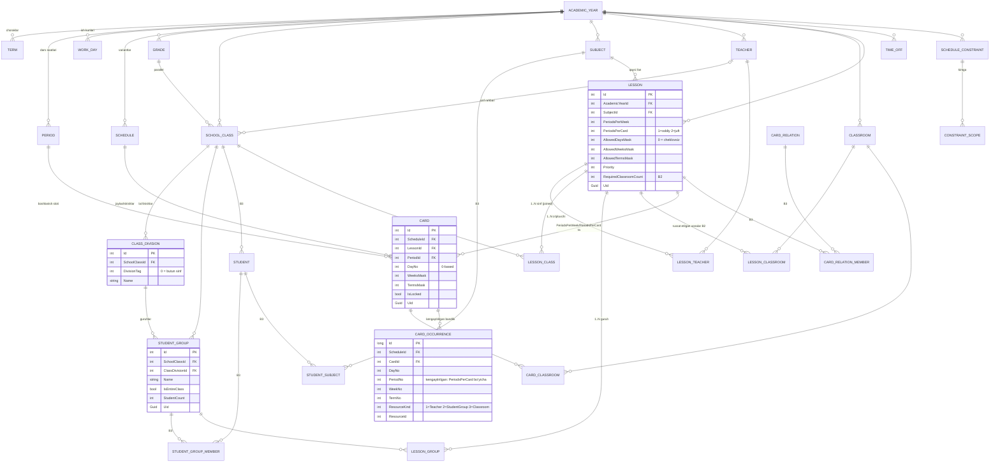

# 00 — MAQSAD ARXITEKTURA (sxema v2 uchun texnik topshiriq)

> **Bu hujjat kimga:** keyingi bosqichda **sxema v2 ni yozadigan agent** uchun.
> **Manba:** `01-asc-data-model.md`, `02-asc-constraints-algorithm.md`, `03-asc-features-ux.md`,
> `04-current-domain-db-audit.md`, `05-current-algorithm-audit.md`, `06-current-ui-build-audit.md`.
> **Branch:** `feat/asc-core` · **Sana:** 2026-08-14 · **Holat:** amaliy spetsifikatsiya, tasdiqlangan qarorlar asosida.
>
> **Belgilar:** `[QAROR]` — foydalanuvchi tasdiqlagan, o'zgartirilmaydi ·
> `[TAXMIN]` — men taxmin qildim, 8-bo'limda so'raladi ·
> `[B1]/[B2]/[B3]` — qaysi bosqichda quriladi.

---

## 1. Maqsad holat — bir sahifalik xulosa

### 1.1 Nima quriladi

`darsjadvali` — **offline, bir maktablik, ish stoli** dars jadvali dasturi. Maqsad model —
aSc TimeTables'ning **yadro ma'lumot modeli**ning soddalashtirilgan, lekin **semantik jihatdan
to'g'ri** ko'chirmasi. Yadro g'oya uch qatlam:

```
Ma'lumotnomalar → Lesson (dars TA'RIFI: nechta soat, kimga, kim)
                → Card (JOYLASHTIRISH: qaysi kun, qaysi soat)
                → CardOccurrence (denormallashgan BANDLIK: DB darajasidagi kafolat)
```

Hozirgi model bu uch qatlamni bittaga (`ScheduleEntry`) siqib qo'ygan. **Asosiy ish — o'rtadagi
`Lesson` qatlamini tiklash, `Card`ni faqat joylashtirishga qoldirish va bandlikni
`CardOccurrence` orqali DB darajasida kafolatlash.**

Ikkinchi yadro g'oya — **guruhlar/bo'linishlar** (`SchoolClass → ClassDivision → StudentGroup`).
Foydalanuvchi maktabida 30 sinf va **150 guruh** bor (sinfiga 5 ta), ya'ni bu ixtiyoriy
qo'shimcha emas — **P0 talab**.

### 1.2 Nima QURILMAYDI (hozircha)

| Nima | Nega | Qachon |
|---|---|---|
| **PostgreSQL provider** | `[QAROR]` — offline desktop, SQLite yetarli. Sxema PG'ga oson ko'chadigan qilib yoziladi (2.2-bo'lim), lekin **ikkinchi provider qo'shilmaydi** | keyin |
| **`School` / multi-tenant** | 1 SQLite fayl = 1 maktab. Keyin qo'shish = `AcademicYear`ga bitta `SchoolId` ustuni | B4 |
| **`Student` / `StudentSubject` / seminar** | `[QAROR]` — real maktabda **0 ta o'quvchi** kiritilgan | B3 |
| **`Classroom` / `Building`** | `[QAROR]` — real maktabda **0 ta xona**. Lekin `RoomNumber` erkin matni **hozirdanoq** `Classroom`ga tayyorlanadi | B2 |
| **O'rinbosarlik (substitution) moduli** | Butunlay alohida sxema, alohida faza | B4+ |
| **`CustomField` (EAV)** | aSc'da bor, bizga hozir kerak emas | B4+ |
| **`DaysDef`/`WeeksDef`/`TermsDef` entity'lari** | Normalizatsiya ortiqcha — `int` bitmask ustunlari bilan almashtiriladi (2.3-bo'lim) | — |
| **`.roz` binar parser** | `01` hujjati tavsiya etmaydi; import faqat `asctt2012` XML orqali | B4+ |
| **`DarsJadvali.UI` (WPF)** | `[QAROR]` — `.sln` dan chiqarilgan, papka saqlanadi, **tegilmaydi** | — |

### 1.3 Uchta o'zgarmas qoida

1. **Har bosqichda `dotnet build` + `dotnet test` yashil.** Bosqich = bitta EF migratsiya +
   unga mos kod + testlar. Yarim qolgan bosqich commit qilinmaydi.
2. **Ma'lumot yo'qolmaydi.** Har bir migratsiya `Down()` bilan qaytariladi; migratsiyadan
   oldin DB fayli avtomatik zaxiralanadi (4.4-bo'lim).
3. **`DarsJadvali.Web` himoyalangan** `[QAROR]` — sxema o'zgarishi Web'ni sindirmasligi kerak;
   sindirsa, o'sha bosqich ichida Web ham tuzatiladi.

---

## 2. Maqsad ma'lumot modeli

### 2.1 Umumiy konvensiyalar (sxema v2 muallifi uchun majburiy)

| Qoida | Qiymat | Sabab |
|---|---|---|
| **Kalit turi** | `int Id` (`BaseEntity`) — **o'zgarmaydi** | Mavjud kod, testlar, Web, Desktop hammasi `int` bilan ishlaydi; `Guid`ga o'tish 3 ta prezentatsiya loyihasini sindiradi. `01` hujjatidagi `uuid` tavsiyasi **rad etiladi** |
| **Barqaror tashqi kalit** | `Guid Uid` — `BaseEntity`da, `ValueGeneratedNever`, kodda `Guid.NewGuid()` | Import/eksport, Desktop↔Web sinxronizatsiyasi, aSc XML mapping (`ExternalId` bilan birga) |
| **Nom uslubi** | Entity — ingliz PascalCase birlik (`SchoolClass`), jadval — ko'plik (`SchoolClasses`), XML izohlar — o'zbekcha | Mavjud kod bilan izchil |
| **Enum saqlash** | `HasConversion<int>()` | Mavjud amaliyot, to'g'ri |
| **Vaqt** | `TimeOnly` + `TimeOnlyToMinutesConverter` (yarim tundan daqiqa, `int`) | `TimeSpan`→ticks o'qib bo'lmaydi (P2-12). Daqiqa PG `time` ga ham, SQLite'ga ham arzon ko'chadi |
| **Sana/vaqt** | `DateTimeOffset` + `TimeProvider` inyeksiyasi | `DateTimeKind` yo'qolishi (P2-17) |
| **Rang** | `string ColorCode` + `CHECK (ColorCode GLOB '#[0-9A-Fa-f][0-9A-Fa-f][0-9A-Fa-f][0-9A-Fa-f][0-9A-Fa-f][0-9A-Fa-f]')`, `HasMaxLength(7)` | P2-18 |
| **Bitmask** | `int` ustun, bit 0 = birinchi kun/hafta/chorak. `varchar` mask **ishlatilmaydi** | Generator ichida `&`/`\|` bilan ishlaydi; `01` dagi `varchar` tanlovi debug uchun edi, bizga tezlik muhim |
| **Kaskad** | Ma'lumotnomalar → `Restrict`; egalik zanjiri (`Schedule→Card`, `Lesson→LessonTeacher`, `Card→CardOccurrence`) → `Cascade` | P1-8 |
| **Soft delete** | **Faqat ma'lumotnomalarda**: `Teacher`, `Subject`, `SchoolClass`, `StudentGroup`, `Classroom`, `Grade`. `Lesson`/`Card`/`CardOccurrence` — **haqiqiy delete** | Jadval yozuvlariga soft delete indekslarni buzadi va foyda bermaydi |
| **Konkurentlik** | `Guid RowVersion`, `IsConcurrencyToken()`, `SaveChanges` interceptorida yangilanadi | SQLite'da `rowversion` yo'q; PG'da `xmin`ga almashtiriladi |
| **Query filter** | `HasQueryFilter(e => !e.IsDeleted)` — faqat soft delete'li entity'larda | P1-10 |

### 2.2 PostgreSQL'ga ko'chish qulayligi uchun cheklovlar (hozir ikkinchi provider QO'SHILMAYDI)

Sxema muallifi quyidagilarga **amal qilishi shart**, aks holda keyinchalik PG'ga ko'chirish qimmat bo'ladi:

- SQLite'ga xos SQL faqat `migrationBuilder.Sql()` ichida, **`OnModelCreating` ichida emas**.
- `CHECK` cheklovlari `builder.ToTable(t => t.HasCheckConstraint(...))` orqali — ikkala providerda ishlaydi.
- Filtered unique index `HasIndex(...).IsUnique().HasFilter("...")` — SQLite va PG sintaksisi bir xil
  (`WHERE "IsActive" = 1` → PG'da `WHERE "IsActive"` bo'ladi; buni **bitta joyda**, `AppDbContext`ning
  `IsSqlite` shartida saqlang).
- `AUTOINCREMENT`ga tayanmang; `int` identity default xatti-harakat.
- `TEXT` ustun uzunliklarini har doim `HasMaxLength()` bilan bering (SQLite e'tibor bermaydi, PG beradi).
- `jsonb` o'rniga `string Parameters` (JSON matn) — `ScheduleConstraint.Parameters`. PG'da keyin `jsonb`ga o'zgartiriladi.
- **`ExecuteDeleteAsync`/`ExecuteUpdateAsync`** ishlating (EF Core 8) — ikkala providerda bor.

### 2.3 Bitmask semantikasi (aniq ta'rif — sxema muallifi shuni qo'llaydi)

`01` hujjatidagi `'0'/'1'` satr o'rniga **`int` bitmask**:

| Ustun | Bit ma'nosi | Misol |
|---|---|---|
| `Lesson.AllowedDaysMask` | bit `d` = `DayNo` (0 = dushanba) | `0b000001` = faqat dushanba; `0` = **cheklov yo'q, istalgan kun** |
| `Lesson.AllowedWeeksMask` | bit `w` = sikldagi hafta indeksi | `0b01` = 1-hafta (toq); `0` = har hafta |
| `Lesson.AllowedTermsMask` | bit `t` = `Term.Ordinal - 1` | `0b0001` = 1-chorak; `0` = butun yil |
| `Card.DayNo` | **bitmask emas, aniq son** | 0..`AcademicYear.DaysPerWeek-1` |
| `Card.WeeksMask` | kartochka qaysi haftalarda turadi | `0b11` = har ikkala hafta |
| `Card.TermsMask` | kartochka qaysi choraklarda turadi | `0b1111` = butun yil |

> **Muhim:** `Lesson.*Mask` = **ruxsat** (cheklov), `Card.*Mask` = **haqiqat** (natija).
> Bir xil nom, ikki xil semantika — `01` §3.1 dagi `classroomids` xatosining takrorlanmasligi uchun
> nomlar ataylab farqlangan: `Allowed*` prefiksi faqat `Lesson`da.

### 2.4 Maqsad ER diagramma



### 2.5 Entity katalogi

`BaseEntity` (v2) — **barcha** entity'lar meros oladi:

```csharp
public abstract class BaseEntity
{
    public int Id { get; set; }
    public Guid Uid { get; set; } = Guid.NewGuid();   // barqaror tashqi kalit
    public DateTimeOffset CreatedAt { get; set; }
    public DateTimeOffset? UpdatedAt { get; set; }
    public Guid RowVersion { get; set; } = Guid.NewGuid();  // IsConcurrencyToken
}

public interface ISoftDeletable { bool IsDeleted { get; set; } }
```

> `IsDeleted` `BaseEntity`da **emas** — faqat `ISoftDeletable` ni implement qilgan
> ma'lumotnomalarda. Shunda `Card`/`CardOccurrence` indekslariga ortiqcha ustun tushmaydi.

Quyidagi jadvalda: **B** = bosqich, **aSc** = aSc'dagi muqobil.

#### A. Vaqt va qamrov (5 ta)

| # | Entity | Maydonlar (C#) | aSc | B |
|---|---|---|---|---|
| 1 | **`AcademicYear`** *(mavjud, kengayadi)* | `Name:string(50)`, `StartYear:int`, `Note:string?(500)`, **`+DaysPerWeek:int=6`**, **`+WeeksInCycle:int=1`**, **`+TermsCount:int=4`**, **`+StartsOn:DateOnly?`**, **`+EndsOn:DateOnly?`** | `academic year` (`#1167`) | B1 |
| 2 | **`Term`** *(yangi)* | `AcademicYearId:int`, `Ordinal:int` (1..N), `Name:string(50)`, `ShortName:string(10)`, `StartsOn:DateOnly?`, `EndsOn:DateOnly?` | `termsdefs` | B1 |
| 3 | **`Schedule`** *(mavjud, kengayadi)* | `AcademicYearId:int`, `Name:string(100)`, `IsActive:bool`, `CreatedAt`, **`+Note:string?(500)`** | fayl darajasidagi variant (aSc'dan **kuchliroq**) | B1 |
| 4 | **`Period`** *(← `LessonSlot`)* | **`+AcademicYearId:int`**, `PeriodNo:int` (0 = "nolinchi soat"), `StartTime:TimeOnly`, `EndTime:TimeOnly`, **`+Name:string?(50)`**, **`+ShortName:string?(10)`**, **`+IsBreak:bool=false`** | `periods` | B1 |
| 5 | **`WorkDay`** *(mavjud, kengayadi)* | **`+AcademicYearId:int`**, **`DayNo:int` (0-based, `DayOfWeek:WeekDay` o'rniga)**, `IsActive:bool`, `MaxLessonsPerDay:int`, **`+Name:string(20)`**, **`+ShortName:string(5)`**, **`+MinLessonsPerDay:int=0`** | `days` | B1 |

> **`DayOfWeek:WeekDay` → `DayNo:int` o'zgarishi.** Sabab: aSc'da hafta 7 kundan uzun bo'lishi
> mumkin (`#2654`), bizda esa `WeekDay` enum 1..7 bilan qattiq bog'langan va `System.DayOfWeek`
> bilan mos emas (P2-13). `WeekDay` enum **saqlanadi** (`WeekDayExtensions.ToUzbek()` UI'da kerak),
> lekin DB'da `DayNo` (0-based) ishlatiladi. Konvertatsiya **bitta joyda**:
> `Domain/Enums/DayNumbering.cs` → `static int ToDayNo(WeekDay) / WeekDay ToWeekDay(int)`.

#### B. Ma'lumotnomalar (7 ta)

| # | Entity | Maydonlar | aSc | B |
|---|---|---|---|---|
| 6 | **`Grade`** *(yangi)* | `AcademicYearId:int`, `GradeNo:int`, `Name:string(50)`, `ShortName:string(16)` | `grades` | B1 |
| 7 | **`SchoolClass`** *(← `ClassGroup`)* | **`+AcademicYearId:int`**, `Name:string(50)`, **`+ShortName:string(24)`**, **`+GradeId:int?`**, **`+ClassTeacherId:int?`**, **`+HomeClassroomId:int?`** *(B2)*, **`+Language:string?(32)`**, `StudentCount:int` *(hisoblanuvchi bo'ladi B3'da)*, `RoomNumber` **→ o'chadi (B2)**, `ExternalId:string?(64)`, `IsDeleted` | `classes` | B1 |
| 8 | **`ClassDivision`** *(yangi)* | `SchoolClassId:int`, `DivisionTag:int` (0 = butun sinf), `Name:string?(64)` | `groups.divisiontag` normalizatsiyasi | **B1** |
| 9 | **`StudentGroup`** *(yangi)* | `SchoolClassId:int`, `ClassDivisionId:int`, `Name:string(64)`, `IsEntireClass:bool`, `StudentCount:int?`, `ExternalId:string?(64)`, `IsDeleted` | `groups` | **B1** |
| 10 | **`Subject`** *(mavjud, kengayadi)* | `Name:string(150)`, `Code`**→`ShortName:string(24)`**, `ColorCode:string(7)`, **`+AcademicYearId:int`**, **`+Distribution:SubjectDistribution` enum**, **`+NeedsHomework:bool`**, **`+MaxStudents:int?`**, **`+RequiresSpecialClassroom:bool`** *(B2)*, `ExternalId:string?(64)`, `IsDeleted` | `subjects` | B1 |
| 11 | **`Teacher`** *(mavjud, kengayadi)* | `FullName:string(200)`, **`+ShortName:string(24)`**, `Phone:string?(50)`, `ColorCode:string(7)`, `IsActive:bool`, **`+AcademicYearId:int`**, **`+FirstName:string?(128)`**, **`+LastName:string?(128)`**, **`+Email:string?(256)`**, **`+Gender:Gender?`**, **`+ContractPeriodsPerWeek:int?`**, **`+MaxLessonsPerDay:int?`**, **`+MaxGapsPerDay:int?`**, **`+IsVacancy:bool`**, `ExternalId:string?(64)`, `IsDeleted` | `teachers` | B1 |
| 12 | **`Classroom`** *(yangi)* | `AcademicYearId:int`, `Name:string(128)`, `ShortName:string(24)`, `Capacity:int?`, `Kind:ClassroomKind` enum, `IsShared:bool`, `ExternalId:string?(64)`, `IsDeleted` | `classrooms` | **B2** |

#### C. Darslar va kartochkalar (8 ta) — **yadro**

| # | Entity | Maydonlar | aSc | B |
|---|---|---|---|---|
| 13 | **`Lesson`** *(yangi)* | `AcademicYearId:int`, `SubjectId:int`, `PeriodsPerWeek:int`, `PeriodsPerCard:int=1`, `AllowedDaysMask:int=0`, `AllowedWeeksMask:int=0`, `AllowedTermsMask:int=0`, `Priority:int=0`, `RequiredClassroomCount:int=0` *(B2)*, `SeminarGroup:int?` *(B3)*, `Capacity:int?` *(B3)*, `ExternalId:string?(64)` | `lessons` | **B1** |
| 14 | **`LessonTeacher`** *(yangi, join)* | `LessonId:int`, `TeacherId:int` — **kompozit PK** | `lessons.teacherids` | B1 |
| 15 | **`LessonClass`** *(yangi, join)* | `LessonId:int`, `SchoolClassId:int` — kompozit PK | `lessons.classids` | B1 |
| 16 | **`LessonGroup`** *(yangi, join)* | `LessonId:int`, `StudentGroupId:int` — kompozit PK | `lessons.groupids` | B1 |
| 17 | **`LessonClassroom`** *(yangi, join)* | `LessonId:int`, `ClassroomId:int`, `Priority:int` — kompozit PK. **RUXSAT ETILGAN** to'plam | `lessons.classroomids` | B2 |
| 18 | **`Card`** *(← `ScheduleEntry`ning joylashtirish qismi)* | `ScheduleId:int`, `LessonId:int`, `PeriodId:int`, `DayNo:int`, `WeeksMask:int=1`, `TermsMask:int` (default = barcha choraklar), `IsLocked:bool=false` | `cards` | **B1** |
| 19 | **`CardClassroom`** *(yangi, join)* | `CardId:int`, `ClassroomId:int` — kompozit PK. **TAYINLANGAN** xona | `cards.classroomids` | B2 |
| 20 | **`CardOccurrence`** *(yangi, denormallashgan)* | `Id:long`, `ScheduleId:int`, `CardId:int`, `DayNo:int`, `PeriodNo:int`, `WeekNo:int`, `TermNo:int`, `ResourceKind:ResourceKind` enum, `ResourceId:int` | `01` §6 dagi `timetable_slot` | **B1** |

#### D. Cheklovlar (5 ta)

| # | Entity | Maydonlar | aSc | B |
|---|---|---|---|---|
| 21 | **`TimeOff`** *(← `TeacherAvailability`)* | `AcademicYearId:int`, `OwnerKind:ResourceOwnerKind` enum, `OwnerId:int`, `DayNo:int`, `PeriodNo:int`, `WeeksMask:int=0`, `TermsMask:int=0`, `Availability:AvailabilityLevel` enum (`Allowed=0`, `NotRecommended=1`, `Forbidden=2`) | `time-off` matritsasi (`#1033`, `#3500`) | **B2** |
| 22 | **`ScheduleConstraint`** *(yangi)* | `AcademicYearId:int`, **`Kind:string(16)` — `02` katalogidagi ID (`C-TCH-01`, `C-DST-07`, …)**, `Importance:ConstraintImportance` enum, `Weight:int` (0..1000), `IsEnabled:bool`, `AllowRelaxation:bool`, `Parameters:string` (JSON matn), `Note:string?` | `constraints` (`#3071`) | B2 |
| 23 | **`ConstraintScope`** *(yangi, join)* | `ScheduleConstraintId:int`, `TargetKind:ResourceOwnerKind`, `TargetId:int` — kompozit PK | `#3028/#3029` | B2 |
| 24 | **`CardRelation`** *(yangi)* | `AcademicYearId:int`, `Kind:string(64)`, `Ordered:bool`, `Importance`, `IsEnabled:bool`, `Parameters:string` | `#1400 Card relationships` | B3 |
| 25 | **`CardRelationMember`** *(yangi, join)* | `CardRelationId:int`, `LessonId:int`, `Side:char` ('A'/'B'), `Ord:int` | — | B3 |

#### E. O'quvchilar (3 ta) — **B3**

| # | Entity | Maydonlar | aSc |
|---|---|---|---|
| 26 | **`Student`** | `AcademicYearId`, `SchoolClassId?`, `FullName`, `FirstName?`, `LastName?`, `Number?`, `Gender?`, `IsDeleted` | `students` |
| 27 | **`StudentGroupMember`** | `StudentId`, `StudentGroupId`, `IsLocked:bool` — kompozit PK | `groups.studentids` |
| 28 | **`StudentSubject`** | `StudentId`, `SubjectId`, `SeminarGroup:int?`, `Importance:enum`, `AlternateForSubjectId:int?` — kompozit PK | `studentsubjects` |

**JAMI: 28 entity** (B1 = 17, B2 = 6, B3 = 5).
**Kiritilmaydi (B4+):** `School`, `Building`, `CustomField`, `CustomFieldValue`, `PrintDesign`,
`Absence`, `Substitution`, `Holiday`.

#### F. Yangi enum'lar (`DarsJadvali.Domain.Enums`)

```csharp
public enum ResourceKind          { Teacher = 1, StudentGroup = 2, Classroom = 3 }
public enum ResourceOwnerKind     { Teacher = 1, StudentGroup = 2, Classroom = 3,
                                    SchoolClass = 4, Subject = 5, Grade = 6, Global = 7 }

/// aSc uch darajali time-off: yashil / "?" / qizil (#1270, #1271, #3500).
/// UI atamasi: Preferred | Allowed | Forbidden — `NotRecommended` = aSc "?" belgisi.
public enum AvailabilityLevel     { Allowed = 0, NotRecommended = 1, Forbidden = 2 }

/// `02` §2.2 dagi qiymatlar AYNAN saqlanadi — Scheduling yadrosi shu sonlarni kutadi.
public enum ConstraintImportance  { Low = 10, Normal = 100, High = 500, Strict = int.MaxValue }
public enum SubjectDistribution   { None = 0, Low = 1, Medium = 2, Ideal = 3, IdealNoConsecutive = 4 }
public enum ClassroomKind         { Regular = 0, Laboratory = 1, Gym = 2, Workshop = 3, Computer = 4 }
public enum Gender                { Male = 1, Female = 2 }
```

`WeekDay` enum **o'zgarmaydi** (CONTRACT §1.1). Unga yordamchi qo'shiladi:

```csharp
public static class DayNumbering
{
    public static int ToDayNo(WeekDay day) => (int)day - 1;      // Dushanba -> 0
    public static WeekDay ToWeekDay(int dayNo) => (WeekDay)(dayNo + 1);
}
```

### 2.6 `CardOccurrence` — nima uchun kerak va qanday quriladi

Bu **eng muhim yangi mexanizm**. Sababi: `Card` bitmask (`WeeksMask`, `TermsMask`) va
`PeriodsPerCard` (juft dars) tufayli **bitta qator bir nechta slotni egallaydi**. Bunday
holatda bandlikni unikal indeks bilan ushlab bo'lmaydi (`AND` amali kerak).

**Yechim:** har bir `Card` uchun kartezian ko'paytma qatorlariga yoyiladi:

```
CardOccurrence = Card
  × { PeriodNo : card.Period.PeriodNo .. +Lesson.PeriodsPerCard-1 }
  × { WeekNo   : WeeksMask dagi yoqilgan bitlar }
  × { TermNo   : TermsMask dagi yoqilgan bitlar }
  × { (ResourceKind, ResourceId) : LessonTeacher ∪ LessonGroup ∪ CardClassroom }
```

Va **bitta unikal indeks** hammasini kafolatlaydi:

```
UNIQUE (ScheduleId, ResourceKind, ResourceId, DayNo, PeriodNo, WeekNo, TermNo)
```

Ya'ni: o'qituvchi ikki joyda bo'lolmaydi, guruh ikki darsda bo'lolmaydi, xona ikki marta
band bo'lolmaydi — **hammasi bitta indeks bilan, DB darajasida.**

**Qayta qurish siyosati:** `CardOccurrence` — **hosila (derived)** jadval. Uni qo'lda
tahrirlash taqiqlanadi. Yagona egasi — `Application` qatlamidagi `ICardOccurrenceProjector`:

```csharp
public interface ICardOccurrenceProjector
{
    Task RebuildForCardAsync(int cardId, CancellationToken ct = default);
    Task RebuildForScheduleAsync(int scheduleId, CancellationToken ct = default);
}
```

`Card` yoki `LessonTeacher`/`LessonGroup`/`CardClassroom` o'zgarganda **o'sha tranzaksiya ichida**
chaqiriladi. Generator butun jadvalni yozgach bir marta `RebuildForScheduleAsync` qiladi.

> `[TAXMIN]` Hajm bahosi: 30 sinf × 5 guruh, ~1500 kartochka, o'rtacha 1 o'qituvchi + 1 guruh +
> 1 hafta + 1 chorak → ~3000 qator. 4 chorak alohida jadval bo'lsa ~12 000 qator. SQLite uchun
> ahamiyatsiz.

### 2.7 Guruhlar/bo'linishlar semantikasi (P0 — aniq ta'rif)

1. Har bir `SchoolClass` yaratilganda **avtomatik** quyidagilar yaratiladi:
   - `ClassDivision { DivisionTag = 0, Name = "Butun sinf" }`
   - `StudentGroup { Name = "Butun sinf", IsEntireClass = true, ClassDivisionId = ↑ }`
2. Foydalanuvchi qo'shimcha bo'linish qo'shadi: `ClassDivision { DivisionTag = 1, Name = "Guruhlar" }`
   → ichida `StudentGroup { "1-guruh" }`, `{ "2-guruh" }`.
3. **Asosiy qoida (aSc `#1895`):** *bir vaqtda dars o'tishi mumkin bo'lgan guruhlar — faqat
   bitta `ClassDivision` ichidagi turli guruhlar.*
4. `IsEntireClass = true` guruh **hech qanday** boshqa guruh bilan parallel bo'la olmaydi.
5. Har bir sinfda **aynan bitta** `IsEntireClass` guruh bo'lishi shart (filtered unique index).

**DB nimani kafolatlaydi va nimani kafolatlamaydi:**

| Qoida | Kim ushlaydi |
|---|---|
| Bir o'qituvchi bir slotda ikki dars | ✅ DB (`CardOccurrence` unikal indeksi) |
| Bir guruh bir slotda ikki dars | ✅ DB |
| Bir xona bir slotda ikki dars | ✅ DB (B2) |
| **Turli bo'linishdagi guruhlar bir slotda** ("O'g'illar" + "Kuchli guruh") | ❌ DB ushlay olmaydi (to'plam kesishuvi) → **Application hard constraint `GROUP_DIVISION_OVERLAP`** |
| **`IsEntireClass` guruh + boshqa guruh bir slotda** | ❌ DB → o'sha constraint |

`GROUP_DIVISION_OVERLAP` ning aniq ta'rifi (sxema muallifi buni `ScheduleValidator`ga qo'shadi):

> Bitta `(ScheduleId, DayNo, PeriodNo, WeekNo, TermNo)` da bitta `SchoolClass`ga tegishli
> ikki yoki undan ortiq kartochka bo'lsa, ularning barcha `StudentGroup`lari **bitta va o'sha
> `ClassDivisionId`** ga tegishli bo'lishi va **o'zaro farqli** bo'lishi shart. Aks holda —
> `ConflictSeverity.Error`.

### 2.8 Cheklovlar saqlanishi — bu **yangi loyihalash**, `02` dan ko'chirma emas

⚠️ **Muhim ogohlantirish sxema muallifiga:** `02-asc-constraints-algorithm.md` — *runtime dvigatel*
spetsifikatsiyasi. Unda `ConstraintDef` entity'si, jadval, EF mapping, JSON params sxemasi
**umuman yo'q**. Quyidagilar shu hujjatning **o'z qarori**:

| `02` dan keladigan mustahkam narsa | Bizning sxemaga qanday tushadi |
|---|---|
| **170 ta cheklov, `C-<SCOPE>-<NN>` ID'lari, 13 guruh** (`C-GBL` 10, `C-AVL` 12, `C-TCH` 34, `C-CLS` 13, `C-LUN` 4, `C-DST` 15, `C-DBL` 12, `C-REL` 28, `C-ROM` 11, `C-BLD` 5, `C-CYC` 7, `C-STU` 13, `C-POS` 6) | `ScheduleConstraint.Kind:string(16)` — **aynan shu ID'lar**. Enum **qilinmaydi** (170 ta qiymat + kelajakda o'sadi) |
| `Importance` (`Low=10, Normal=100, High=500, Strict=int.MaxValue`) | `ConstraintImportance` enum, `HasConversion<int>()` |
| `AllowRelaxation` (`#3072`), `Enabled` (`#3311`) | `AllowRelaxation:bool`, `IsEnabled:bool` |
| Og'irliklar 0–1000 shkalasi | `Weight:int` + `CHECK (Weight BETWEEN 0 AND 1000)` |
| Parametrlar (`maxGapsWeek`, `maxDays`, `maxConsec`, `min/max/emptyDayOk`, `mask`, `[from,to]`, `weeks[]`, `terms[]`, `days[]`, `roomSet`, `nDays`, `n`) | `Parameters:string` — **JSON matn**, `{"maxGapsDay":2}` ko'rinishida. PG'da keyin `jsonb` |
| Apply-to scope'lar (selected teachers / classes / subjects / groups / grades / students / global) | `ConstraintScope(TargetKind, TargetId)` — 0 qator = global |
| `H*` (odatda hard, `AllowRelaxation` yoqilsa soft) | `Importance = Strict` **va** `AllowRelaxation = true` kombinatsiyasi |

**B1'da `ScheduleConstraint` jadvali YARATILMAYDI.** Lekin `Teacher.MaxLessonsPerDay`/`MaxGapsPerDay`
va `WorkDay.MinLessonsPerDay`/`MaxLessonsPerDay` ustunlari B1'da qo'shiladi (`C-TCH-01`,
`C-TCH-02`, `C-CLS-01` ning eng ko'p ishlatiladigan holatlari) — bu ataylab **dublikat**:
generik mexanizm B2'da kelganda bu ustunlar `ScheduleConstraint` qatorlariga **ko'chiriladi va
o'chiriladi** (`V2_08` migratsiyasi).

### 2.9 Chop etish / hisobot read-model'i (`03` §3.5 talablari)

`03` hujjati chop etish tili (`def.xml`) uchun **oldindan JOIN qilingan** maydonlar talab qiladi.
Sxema v2 shularni **bevosita** berishi shart (aks holda B2'da denormalizatsiya kerak bo'ladi):

| Chop etish tokeni | Sxemadagi manba | Bor/yo'q |
|---|---|---|
| `{class}`, `{#1035:#1635}` | `SchoolClass.Name` | ✅ |
| `{class_teacher}`, `{#1035:#1532}` | `SchoolClass.ClassTeacherId → Teacher.FullName` | ✅ **B1'da qo'shiladi** |
| `{home_classroom}`, `{#1035:#1067}` | `SchoolClass.HomeClassroomId → Classroom.Name` | ⏳ B2 |
| `{teachers}` (vergul bilan) | `LessonTeachers → Teacher.ShortName` | ✅ |
| `{group}` (28008) | `LessonGroups → StudentGroup.Name` | ✅ |
| `{length}` | `Lesson.PeriodsPerCard` | ✅ |
| `{count}` | `COUNT(Card WHERE LessonId=…)` | ✅ |
| `{total}`, `{totallessons}` (28004, `{sum}`) | `SUM(count × length)` | ✅ |
| `{weeks}`, `{terms}` | `Card.WeeksMask`, `Card.TermsMask` | ✅ |
| `{#3148:#1166}` maktab nomi, `{#1167}` o'quv yili | `AppInfo`/konfiguratsiya + `AcademicYear.Name` | 🟡 `School` yo'q (B4) |
| `{cf:<key>}` custom field | — | ❌ B4+ |

> **Xulosa:** `SchoolClass.ClassTeacherId` va `Teacher.ShortName` **B1'da majburiy** — ularsiz
> hisobotlar B2'da qayta migratsiya talab qiladi.

---

## 3. Mavjuddan maqsadga o'tish jadvali

### 3.1 Entity darajasidagi qaror

| Mavjud entity | Qaror | Nima bo'ladi | Nega |
|---|---|---|---|
| `AcademicYear` | 🟢 **saqlanadi + kengayadi** | `DaysPerWeek`, `WeeksInCycle`, `TermsCount`, `StartsOn`, `EndsOn` qo'shiladi | Yagona qamrov ildizi; aSc'da bu fayl darajasida — bizda **kuchliroq** |
| `Schedule` | 🟢 **saqlanadi** | `IsActive` uchun filtered unique index qo'shiladi | Jadval variantlari — loyihaning kuchli tomoni (04 §4) |
| `Subject` | 🟡 **o'zgaradi** | `Code` → `ShortName`; `AcademicYearId`, `Distribution`, `IsDeleted` va h.k. qo'shiladi | aSc `subjects` bilan moslash |
| `Teacher` | 🟡 **o'zgaradi** | `ShortName`, `AcademicYearId`, kontrakt/yuklama maydonlari qo'shiladi | Yuklama hisobi va aSc mosligi |
| `ClassGroup` | 🟡 **qayta nomlanadi → `SchoolClass`** | + `GradeId`, `ClassTeacherId`, `ShortName`, `AcademicYearId`; `RoomNumber` → `Classroom` (B2) | Nom chalkash: `ClassGroup` "sinf" ham, "guruh" ham degandek. Endi `SchoolClass` = sinf, `StudentGroup` = guruh |
| `LessonSlot` | 🟡 **qayta nomlanadi → `Period`** | + `AcademicYearId`, `PeriodNo` (0-dan), `Name`, `IsBreak`; `TimeSpan` → `TimeOnly` | aSc `periods`; global bo'lishi arxivni buzadi (P0-6) |
| `WorkDay` | 🟡 **o'zgaradi** | + `AcademicYearId`, `DayNo` (0-based), `Name`, `ShortName`, `MinLessonsPerDay` | P0-6, P2-13 |
| `TeacherAssignment` | 🔴 **bo'linadi va o'chadi** | → `Lesson` + `LessonTeacher` + `LessonClass` + `LessonGroup` | 1 ta biriktirma ≠ 1 ta dars: aSc'da 1 fan uchun 1×juft + 1×yakka = 2 ta `Lesson` |
| `ScheduleEntry` | 🔴 **bo'linadi va o'chadi** | → `Card` + `CardOccurrence` (3.2-bo'lim) | **Yadro o'zgarish** |
| `TeacherAvailability` | 🔴 **almashtiriladi (B2)** | → `TimeOff` | Vaqt oralig'i o'rniga `(DayNo, PeriodNo)` matritsasi — aSc ham shunday (P2-16) |

**Xulosa:** mavjud 10 entity'dan **7 tasi qoladi** (3 tasi qayta nomlanadi), **3 tasi o'chadi**.

### 3.2 `ScheduleEntry` → `Lesson` + `Card` — batafsil

`ScheduleEntry` bugun **uchta** mas'uliyatni bajaradi:

```
ScheduleEntry {
  ScheduleId, ClassGroupId, SubjectId, TeacherId   ← (a) DARS TA'RIFI (nima o'qitiladi)
  DayOfWeek, LessonNumber                          ← (b) JOYLASHTIRISH (qayerda turibdi)
  RoomNumber                                        ← (c) RESURS (qaysi xona)
}
```

Yangi taqsimot:

| Eski maydon | Yangi joy | Izoh |
|---|---|---|
| `SubjectId` | `Lesson.SubjectId` | 1:1 |
| `TeacherId` | `LessonTeacher.TeacherId` | 1:N bo'ladi (co-teaching) |
| `ClassGroupId` | `LessonClass.SchoolClassId` + `LessonGroup.StudentGroupId` | 1:N (joined classes) + guruh o'lchovi |
| — *(yangi)* | `Lesson.PeriodsPerWeek` | `TeacherAssignment.WeeklyHoursCount` dan keladi |
| — *(yangi)* | `Lesson.PeriodsPerCard` | migratsiyada **har doim 1**; juft darslar keyin qo'lda |
| `ScheduleId` | `Card.ScheduleId` | 1:1 |
| — *(yangi)* | `Card.LessonId` | **eng muhim yangi FK** — reja ↔ fakt bog'lanishi (P0-2) |
| `DayOfWeek` | `Card.DayNo` = `(int)DayOfWeek - 1` | 0-based |
| `LessonNumber` | `Card.PeriodId` → `Period.PeriodNo == LessonNumber` | endi **FK**, erkin son emas (P0-5) |
| — *(yangi)* | `Card.WeeksMask = 1`, `Card.TermsMask` = barcha bitlar | migratsiyada "har hafta, butun yil" |
| — *(yangi)* | `Card.IsLocked = false` | |
| `RoomNumber` | B2'da `CardClassroom` | B1'da vaqtincha `Card.LegacyRoomNumber:string?` sifatida **saqlab qolinadi** |
| — *(yangi)* | `CardOccurrence` × N | projector generatsiya qiladi |

> **`Card.LegacyRoomNumber` — ataylab.** B1'da `Classroom` entity yo'q, lekin foydalanuvchi
> ma'lumotidagi xona matnini yo'qotib bo'lmaydi. U B2'da `Classroom` yaratilgach ko'chiriladi
> va ustun o'chiriladi. Bu vaqtinchalik ustun `[TAXMIN]`-emas, **majburiy qaror**.

**Nima yutiladi:**
- "5-A, Matematika: 5 soatdan 3 tasi qo'yildi" — endi hisoblanadi (`Lesson.PeriodsPerWeek` vs `COUNT(Card)`).
- Biriktirmasiz dars yozib bo'lmaydi (`Card.LessonId` — `NOT NULL` FK).
- Juft dars (`PeriodsPerCard=2`) modellanadi.
- Guruhlar parallel dars o'ta oladi.
- Bir darsda 2 o'qituvchi, bir darsda 2 sinf (joined) modellanadi.

**Nima yo'qoladi (ataylab):**
- `NO_ASSIGNMENT` konflikt kodi **ma'nosini yo'qotadi** — FK uni imkonsiz qiladi. Kod
  `ConflictCodes`da **saqlanadi** (CONTRACT), lekin hech qachon chiqmaydi. Testlar mos moslanadi.

---

## 4. Migratsiya rejasi

### 4.1 Migratsiyalar ketma-ketligi (EF Core, aynan shu nomlar bilan)

| # | Migratsiya nomi | Qamrov | Xavf | Bosqich |
|---|---|---|---|---|
| 1 | `V2_01_AuditAndSafety` | `BaseEntity` → `Uid`, `CreatedAt`, `UpdatedAt`, `RowVersion`; `ISoftDeletable` + `IsDeleted` (6 ta ma'lumotnomada); `Schedules(IsActive)` filtered unique; ma'lumotnoma FK'lari `Cascade`→`Restrict`; `AuditSaveChangesInterceptor` | 🟢 past | **B1** |
| 2 | `V2_02_TimeStructure` | `Periods` (← `LessonSlots` rename) + `AcademicYearId` + `PeriodNo` + `Name`/`ShortName`/`IsBreak`, `TimeSpan`→daqiqa; `WorkDays` + `AcademicYearId` + `DayNo`; yangi `Terms` jadvali; `AcademicYears` + `DaysPerWeek`/`WeeksInCycle`/`TermsCount`/`StartsOn`/`EndsOn` | 🟡 o'rta | **B1** |
| 3 | `V2_03_ClassStructure` | `Grades`; `ClassGroups`→`SchoolClasses` rename + yangi ustunlar; `ClassDivisions`; `StudentGroups` + har sinf uchun "Butun sinf" guruhi; `Subjects`/`Teachers` yangi ustunlari (`ShortName`, `AcademicYearId`, …) | 🟡 o'rta | **B1** |
| 4 | `V2_04_LessonAndCard` | `Lessons`, `LessonTeachers`, `LessonClasses`, `LessonGroups`, `Cards`, `CardOccurrences`; **ma'lumot ko'chirish** (4.3) | 🔴 **yuqori** | **B1** |
| 5 | `V2_05_DropLegacyEntry` | `ScheduleEntries` va `TeacherAssignments` jadvallarini o'chirish (faqat 4.5 tekshiruvlari o'tgach) | 🔴 yuqori | **B1** |
| 6 | `V2_06_TimeOff` | `TimeOffs`; `TeacherAvailabilities` dan ko'chirish; eski jadval o'chadi | 🟡 o'rta | B2 |
| 7 | `V2_07_Classrooms` | `Classrooms`, `LessonClassrooms`, `CardClassrooms`; `SchoolClass.RoomNumber` + `Card.LegacyRoomNumber` dan ko'chirish; ikkala ustun o'chadi | 🟡 o'rta | B2 |
| 8 | `V2_08_Constraints` | `ScheduleConstraints`, `ConstraintScopes` | 🟢 past | B2 |
| 9 | `V2_09_Students` | `Students`, `StudentGroupMembers`, `StudentSubjects`; `CardRelations`, `CardRelationMembers` | 🟢 past | B3 |

> **1-bosqich = migratsiyalar 1–5.** Har biri alohida commit, har biridan keyin
> `dotnet build` + `dotnet test` yashil.

### 4.2 SQLite'ga xos ehtiyot choralari (sxema muallifi uchun)

1. **`RenameTable` ishlaydi**, lekin `RenameColumn` SQLite'da jadvalni qayta quradi —
   `ClassGroups`→`SchoolClasses` uchun EF `RenameTable` yetarli.
2. **`DROP COLUMN`** — SQLite 3.35+ da bor, EF Core 8 uni qo'llaydi, lekin indeks/FK
   bog'liqligi bo'lsa jadval qayta quriladi. `V2_05` va `V2_07` da buni hisobga oling.
3. **Har bir migratsiya EF tomonidan bitta tranzaksiyada qo'llanadi** — `migrationBuilder.Sql()`
   bilan yozilgan ma'lumot ko'chirish ham shu tranzaksiyaga tushadi. Ma'lumot ko'chirishni
   **struktura o'zgarishi bilan bitta migratsiyada** qoldiring, alohida qilmang.
4. **`PRAGMA foreign_keys`** — EF SQLite migratsiya paytida uni o'chiradi; qayta yoqilganini
   `PRAGMA foreign_key_check` bilan migratsiyadan keyin tekshiring (4.5).
5. `migrationBuilder.Sql()` ichida **C# `DateTime.Now` ni interpolatsiya qilmang** (P3-23) —
   `datetime('now')` yoki `strftime` ishlating, aks holda migratsiya deterministik emas.

### 4.3 `V2_04` — ma'lumot ko'chirish algoritmi (aynan shu tartibda)

Kirish: `TeacherAssignments` (N ta), `ScheduleEntries` (M ta), `Schedules`, `AcademicYears`.

```
-- 0. Har bir SchoolClass uchun "Butun sinf" guruhi V2_03 da allaqachon yaratilgan.
--    entireGroup(classId) = StudentGroups WHERE SchoolClassId=classId AND IsEntireClass=1

-- 1. TeacherAssignment -> Lesson (+ 3 ta join qatori)
FOR EACH ta IN TeacherAssignments:
    lesson = INSERT Lessons(
        AcademicYearId  = <faol AcademicYear.Id>,     -- TA'da yil yo'q edi
        SubjectId       = ta.SubjectId,
        PeriodsPerWeek  = ta.WeeklyHoursCount,
        PeriodsPerCard  = 1,
        AllowedDaysMask = 0, AllowedWeeksMask = 0, AllowedTermsMask = 0,
        Priority        = 0)
    INSERT LessonTeachers(lesson.Id, ta.TeacherId)
    INSERT LessonClasses (lesson.Id, ta.ClassGroupId)
    INSERT LessonGroups  (lesson.Id, entireGroup(ta.ClassGroupId))
    map[(ta.TeacherId, ta.SubjectId, ta.ClassGroupId)] = lesson.Id

-- 2. ScheduleEntry -> Card
FOR EACH se IN ScheduleEntries ORDER BY se.Id:
    key = (se.TeacherId, se.SubjectId, se.ClassGroupId)
    IF key NOT IN map:
        -- YETIM YOZUV: biriktirmasiz dars. Ma'lumot YO'QOTILMAYDI —
        -- shu uchlik uchun avtomatik Lesson yaratiladi.
        cnt = COUNT(ScheduleEntries WHERE bir xil uchlik)
        lesson = INSERT Lessons(... PeriodsPerWeek = cnt, PeriodsPerCard = 1 ...)
        INSERT LessonTeachers / LessonClasses / LessonGroups
        map[key] = lesson.Id
        LOG "Yetim yozuv uchun avtomatik dars yaratildi: <sinf> <fan> <o'qituvchi>"

    periodId = Periods WHERE AcademicYearId = schedule.AcademicYearId
                         AND PeriodNo = se.LessonNumber
    IF periodId IS NULL:
        -- Yo'q dars soati (masalan LessonNumber=9, Periods faqat 7 ta).
        -- Yetishmayotgan Period AVTOMATIK yaratiladi (StartTime = oxirgisi + 55 daq).
        periodId = INSERT Periods(...)
        LOG "Yetishmayotgan dars soati yaratildi: <n>"

    INSERT Cards(
        ScheduleId       = se.ScheduleId,
        LessonId         = map[key],
        PeriodId         = periodId,
        DayNo            = (int)se.DayOfWeek - 1,
        WeeksMask        = 1,
        TermsMask        = (1 << AcademicYear.TermsCount) - 1,   -- butun yil
        IsLocked         = 0,
        LegacyRoomNumber = se.RoomNumber)

-- 3. Card -> CardOccurrence (projector mantig'i, SQL bilan)
FOR EACH card:
    FOR pn IN card.Period.PeriodNo .. +lesson.PeriodsPerCard-1:   -- migratsiyada har doim 1 ta
      FOR wk IN bits(card.WeeksMask):
        FOR tm IN bits(card.TermsMask):
          FOR t IN LessonTeachers(card.LessonId):
              INSERT CardOccurrences(card.ScheduleId, card.Id, card.DayNo, pn, wk, tm, Teacher, t)
          FOR g IN LessonGroups(card.LessonId):
              INSERT CardOccurrences(card.ScheduleId, card.Id, card.DayNo, pn, wk, tm, StudentGroup, g)
```

**Kutilgan invariantlar (migratsiyadan keyin `V2_05` dan OLDIN tekshiriladi):**

```
COUNT(Cards)                 == COUNT(ScheduleEntries)       -- 1:1
COUNT(Lessons)               >= COUNT(TeacherAssignments)    -- yetimlar tufayli >= bo'lishi mumkin
SUM(Lessons.PeriodsPerWeek)  >= COUNT(Cards)                 -- reja >= fakt
COUNT(CardOccurrences)       == COUNT(Cards) * 2             -- har card: 1 o'qituvchi + 1 guruh
0 == (SELECT COUNT(*) FROM pragma_foreign_key_check)
```

> ⚠️ **Yagona haqiqiy xavf:** eski `ScheduleEntries` da **bitmask yo'q edi**, shuning uchun
> `TermsMask` hammaga "butun yil" qilib qo'yiladi. Agar foydalanuvchi haqiqatda **chorak
> bo'yicha alohida `Schedule` variantlari** yaratgan bo'lsa (real maktabda aSc'da har chorak
> alohida **fayl** edi — `01` §5.6), ular alohida `Schedule` bo'lib qoladi va bu **to'g'ri**.
> Ularni bitta `Schedule` + `TermsMask` ga birlashtirish — **qo'lda, keyingi bosqichda**
> (8-bo'limdagi 1-savol).

### 4.4 Zaxira va rollback

**Zaxira (majburiy, avtomatik):** `DatabaseInitializer.InitializeAsync()` da,
`MigrateAsync()` dan **oldin**:

```csharp
// Infrastructure/Persistence/DatabaseBackupService.cs (yangi)
public interface IDatabaseBackupService
{
    /// Kutilayotgan migratsiya bo'lsa DB faylini nusxalaydi. Yo'l qaytaradi.
    Task<string?> BackupIfPendingAsync(CancellationToken ct = default);
}
```

- Shart: `(await db.Database.GetPendingMigrationsAsync()).Any()`.
- Nusxa yo'li: `<DbDir>/backups/darsjadvali-<yyyyMMdd-HHmmss>-<oxirgi migratsiya nomi>.db`.
- Usul: `VACUUM INTO '<path>'` (SQLite 3.27+, EF ulanishi ochiq bo'lganda ham xavfsiz).
  Fayl nusxalash **emas** — WAL fayli tufayli nusxa nomuvofiq bo'lishi mumkin.
- Oxirgi **5 ta** zaxira saqlanadi, eskisi o'chiriladi.
- Xatolik bo'lsa — **migratsiya boshlanmaydi**, foydalanuvchiga o'zbekcha xabar.

**Rollback — 3 daraja:**

| Daraja | Qachon | Qanday |
|---|---|---|
| **1. EF `Down()`** | Migratsiya qo'llandi, lekin xato aniqlandi | `dotnet ef database update V2_03_ClassStructure --project src/DarsJadvali.Infrastructure`. **Har bir migratsiyada `Down()` to'liq yozilishi SHART** (EF avtomatik generatsiya qilgani yetarli emas — `migrationBuilder.Sql()` ko'chirishlari uchun teskari SQL qo'lda yoziladi) |
| **2. Fayl zaxirasi** | `Down()` ishlamadi yoki ma'lumot buzildi | `backups/` dan nusxani `darsjadvali.db` ustiga qo'yish. UI'da "Zaxiradan tiklash" tugmasi `[TAXMIN]` — B2'da |
| **3. Branch** | Butun yondashuv noto'g'ri | `feat/asc-core` branch, `main` tegilmagan |

**`Down()` uchun aniq talab (`V2_04`):** `Cards` → `ScheduleEntries` ga teskari ko'chirish
yoziladi:
`ScheduleEntry(ScheduleId, ClassGroupId = LessonClasses'dan birinchi, SubjectId = Lesson.SubjectId,
TeacherId = LessonTeachers'dan birinchi, DayOfWeek = DayNo+1, LessonNumber = Period.PeriodNo,
RoomNumber = Card.LegacyRoomNumber)`.
Ko'p o'qituvchi/ko'p sinf bo'lsa **ma'lumot yo'qoladi** — bu `Down()` izohida yozilishi shart.

### 4.5 Migratsiya testlari (`tests/DarsJadvali.Tests/DatabaseMigrationTests.cs` kengaytiriladi)

Har bir migratsiya uchun majburiy testlar:

1. `Bosh_bazada_barcha_migratsiyalar_qollanadi` — `EnsureDeleted` → `MigrateAsync` → xatosiz.
2. `Toldirilgan_bazada_V2_04_malumotni_yoqotmaydi` — v1 sxemasida 30 sinf × 6 kun × 7 soat
   seed → migratsiya → 4.3 dagi **to'rt invariant** tekshiriladi.
3. `V2_04_yetim_ScheduleEntry_uchun_Lesson_yaratadi` — biriktirmasiz yozuv qo'shiladi, migratsiyadan
   keyin unga `Lesson` topiladi.
4. `V2_04_Down_ScheduleEntries_ni_tiklaydi` — `Down()` dan keyin qator soni mos.
5. `CardOccurrence_unikal_indeksi_ikki_karra_bandlikni_tosadi` — qo'lda ikkita bir xil
   `(ResourceKind, ResourceId, slot)` qo'shishga urinish → `DbUpdateException`.
6. `Har_sinfda_aynan_bitta_IsEntireClass_guruh_bor` — filtered unique index testi.
7. `Foreign_key_check_bosh` — `PRAGMA foreign_key_check` 0 qator.

> `TestDbFactory` hozir `:memory:` + `EnsureCreated()` ishlatadi (ARXITEKTURA §6). Migratsiya
> testlari uchun **`EnsureCreated` emas, `MigrateAsync`** kerak — `TestDbFactory` ga
> `CreateMigrated()` metodi qo'shiladi. Qolgan 147 test o'zgarmaydi.

---

## 5. Buziladigan cheklovlar ro'yxati

### 5.1 O'chadigan / o'zgaradigan indekslar

| Eski cheklov | Fayl | Qaror | O'rniga qanday kafolat |
|---|---|---|---|
| `ScheduleEntries(ScheduleId, ClassGroupId, DayOfWeek, LessonNumber)` UNIQUE | `ScheduleEntryConfiguration.cs:45` | 🔴 **O'CHADI** | `CardOccurrences(ScheduleId, ResourceKind, ResourceId, DayNo, PeriodNo, WeekNo, TermNo)` UNIQUE — `ResourceKind = StudentGroup`. **Nega o'chadi:** bu indeks bitta sinfda ikki guruhning parallel darsini fizik jihatdan taqiqlaydi (P0-1) — 150 guruhli maktabda bu blokerdir |
| `ScheduleEntries(ScheduleId, TeacherId, DayOfWeek, LessonNumber)` UNIQUE | `:46` | 🔴 **O'CHADI** | Xuddi shu indeks, `ResourceKind = Teacher`. Qo'shimcha: endi hafta/chorak o'lchovi ham qamrab olinadi |
| `TeacherAssignments(TeacherId, SubjectId, ClassGroupId)` UNIQUE | `TeacherAssignmentConfiguration.cs:32` | 🔴 **O'CHADI, o'rniga hech narsa qo'yilmaydi** | **Ataylab:** aSc'da bitta (o'qituvchi, fan, sinf) uchligi uchun bir nechta `Lesson` bo'lishi **normal** (1×juft dars + 1×yakka dars = haftada 3 soat, `01` §3.5). Uning o'rniga: `Lesson`ga `CHECK (PeriodsPerWeek > 0 AND PeriodsPerCard BETWEEN 1 AND 8 AND PeriodsPerWeek >= PeriodsPerCard)` + Application darajasida "bu uchlik uchun jami soat" ogohlantirishi |
| `LessonSlots(LessonNumber)` UNIQUE | `LessonSlotConfiguration.cs:26` | 🟡 **kengayadi** | `Periods(AcademicYearId, PeriodNo)` UNIQUE — har yil o'z qo'ng'irog'iga ega (P0-6) |
| `WorkDays(DayOfWeek)` UNIQUE | `WorkDayConfiguration.cs:27` | 🟡 **kengayadi** | `WorkDays(AcademicYearId, DayNo)` UNIQUE |
| `ClassGroups(Name)` UNIQUE | `ClassGroupConfiguration.cs:25` | 🟡 **kengayadi** | `SchoolClasses(AcademicYearId, Name)` UNIQUE + `SchoolClasses(AcademicYearId, ShortName)` UNIQUE |
| `Subjects(Code)` UNIQUE | `SubjectConfiguration.cs:28` | 🟡 **kengayadi + qo'shiladi** | `Subjects(AcademicYearId, ShortName)` UNIQUE **va** `Subjects(AcademicYearId, Name)` UNIQUE (P2-15) |
| `AcademicYears(Name)` UNIQUE | `AcademicYearConfiguration.cs:23` | 🟢 **o'zgarmaydi** | — |
| `Schedules(AcademicYearId, Name)` UNIQUE | `ScheduleConfiguration.cs:31` | 🟢 **o'zgarmaydi** | — |
| `Schedules(IsActive)` — **oddiy** indeks | `ScheduleConfiguration.cs:34` | 🟡 **UNIKAL bo'ladi** | `HasIndex(x => x.IsActive).IsUnique().HasFilter("\"IsActive\" = 1")` — P1-7 tuzatiladi |
| `TeacherAvailabilities(TeacherId, DayOfWeek)` oddiy | `TeacherAvailabilityConfiguration.cs:37` | 🔴 **O'CHADI (B2)** | `TimeOffs(AcademicYearId, OwnerKind, OwnerId, DayNo, PeriodNo, WeeksMask, TermsMask)` UNIQUE — ustma-ust tushuvchi oraliqlar imkonsiz bo'ladi (P2-16) |
| 9 ta FK `DeleteBehavior.Cascade` | 4 ta konfiguratsiya fayli | 🔴 **`Restrict` bo'ladi** | Ma'lumotnomalar (`Teacher`, `Subject`, `SchoolClass`, `Grade`, `Classroom`, `Period`) → `Restrict`. `Cascade` faqat egalik zanjirida: `Schedule→Card`, `Lesson→Lesson*`, `Card→CardOccurrence`, `SchoolClass→ClassDivision→StudentGroup`, `AcademicYear→*` (P1-8) |

### 5.2 Yangi qo'shiladigan cheklovlar

| Cheklov | Nima kafolatlaydi |
|---|---|
| `CardOccurrences(ScheduleId, ResourceKind, ResourceId, DayNo, PeriodNo, WeekNo, TermNo)` **UNIQUE** | O'qituvchi / guruh / xona bir slotda bir marta. **Sxemaning eng muhim indeksi** |
| `CardOccurrences(ScheduleId, DayNo, PeriodNo)` oddiy | Jadval ekranini chizish uchun |
| `StudentGroups(SchoolClassId)` UNIQUE **WHERE `IsEntireClass` = 1** | Har sinfda aynan bitta "Butun sinf" guruhi |
| `ClassDivisions(SchoolClassId, DivisionTag)` UNIQUE | Bo'linish raqami takrorlanmaydi |
| `StudentGroups(ClassDivisionId, Name)` UNIQUE | Bir bo'linish ichida bir xil nomli ikki guruh yo'q |
| `Cards(ScheduleId, LessonId, DayNo, PeriodId, WeeksMask, TermsMask)` UNIQUE | Bir dars bir slotga ikki marta qo'yilmaydi |
| `LessonTeachers` / `LessonClasses` / `LessonGroups` / `LessonClassrooms` / `CardClassrooms` — **kompozit PK** | Takroriy bog'lanish yo'q |
| `Terms(AcademicYearId, Ordinal)` UNIQUE | Chorak raqami takrorlanmaydi |
| `Grades(AcademicYearId, GradeNo)` UNIQUE | |
| `Teachers(AcademicYearId, ShortName)` UNIQUE (nofaol/o'chirilganlarni hisobga olmagan holda: `HasFilter("\"IsDeleted\" = 0")`) | Qisqartma noyob |
| `CHECK` — `Lesson`: `PeriodsPerWeek > 0`, `PeriodsPerCard BETWEEN 1 AND 8`, `PeriodsPerWeek >= PeriodsPerCard` | Ma'nosiz dars ta'rifi yo'q |
| `CHECK` — `Period`: `EndTime > StartTime`, `PeriodNo >= 0` | P0-5 |
| `CHECK` — `WorkDay`: `MaxLessonsPerDay BETWEEN 0 AND 20`, `DayNo BETWEEN 0 AND 13` | |
| `CHECK` — `Card`: `DayNo >= 0`, `WeeksMask > 0`, `TermsMask > 0` | Joylashtirilmagan kartochka `Card` emas — u shunchaki mavjud emas |
| `CHECK` — rang: `ColorCode GLOB '#[0-9A-Fa-f][0-9A-Fa-f][0-9A-Fa-f][0-9A-Fa-f][0-9A-Fa-f][0-9A-Fa-f]'` | P2-18 |

### 5.3 Application darajasidagi yangi hard constraint'lar (DB ushlay olmaydi)

| Kod | Qoida |
|---|---|
| `GROUP_DIVISION_OVERLAP` | 2.7-bo'limdagi ta'rif |
| `CARD_OUTSIDE_ALLOWED_DAYS` | `Lesson.AllowedDaysMask != 0` va `(mask & (1 << card.DayNo)) == 0` |
| `CARD_OUTSIDE_ALLOWED_WEEKS/TERMS` | Xuddi shunday |
| `DOUBLE_LESSON_SPANS_BREAK` | `PeriodsPerCard > 1` va oraliqda `Period.IsBreak = true` bo'lsa |
| `LESSON_OVER_PLACED` | `COUNT(Card WHERE LessonId=…) * PeriodsPerCard > PeriodsPerWeek` — hozirgi `WEEKLY_HOURS_EXCEEDED` ning aniq varianti |

### 5.4 🔴 Indekslarni NOMLASH majburiy (UI'ni sindirmaslik uchun)

`06` auditi (**M-19**) aniqladi: `src/DarsJadvali.Desktop/ViewModels/SubjectsViewModel.cs:279`
dagi `UniqueViolation` yordamchisi SQLite'ning **xato matnini** tahlil qilib, qaysi ustun
takrorlanganini aniqlaydi. Indeks nomi yoki ustunlar o'zgarsa bu **jimgina buziladi** —
foydalanuvchi tushunarsiz "Baza xatosi" xabarini oladi.

**Talab:**

1. **Har bir indeksga aniq nom beriladi:**
   `HasIndex(...).IsUnique().HasDatabaseName("UX_Subjects_AcademicYearId_ShortName")`.
   Konvensiya: `UX_<Jadval>_<Ustunlar>` (unikal), `IX_<Jadval>_<Ustunlar>` (oddiy),
   `CK_<Jadval>_<Qoida>` (check), `FK_<Jadval>_<Maqsad>` (tashqi kalit).
2. **Infrastructure SQLite xatosini tipizatsiya qiladi** — yangi
   `src/DarsJadvali.Infrastructure/Persistence/SqliteExceptionTranslator.cs`:

```csharp
// Application/Abstractions/UniqueConstraintViolationException.cs (yangi)
public sealed class UniqueConstraintViolationException : Exception
{
    public string IndexName { get; }               // "UX_Subjects_AcademicYearId_ShortName"
    public IReadOnlyList<string> Columns { get; }  // ["AcademicYearId", "ShortName"]
}
```

   `UnitOfWork.SaveChangesAsync` `SqliteException` (kod 19 / 2067) ni ushlab shu turga
   o'giradi. **ViewModel'lar endi xato matnini tahlil qilmaydi** — `IndexName`/`Columns`
   bo'yicha o'zbekcha xabar tanlaydi.
3. Bu **`V2_01` da, sxema o'zgarishidan OLDIN** qilinadi — shunda keyingi indeks
   o'zgarishlari UI'ni sindirmaydi.

### 5.5 🔴 SQLite konkurentlik sozlamalari (bir necha jarayon bitta faylni ochadi)

`06` auditi (**W-02**) aniqladi: ulanish satri yalang'och `Data Source={path}` —
`journal_mode`, `busy_timeout`, `Pooling` **umuman sozlanmagan**
(`InfrastructureServiceRegistration.cs:82`). Desktop va Web **bitta**
`%LOCALAPPDATA%/DarsJadvali/darsjadvali.db` faylini ochadi → `SQLITE_BUSY`, retry yo'q.
Tranzaksiya joriy qilingach (6.4) bu **ehtimolligi ortadigan** muammo.

**`V2_01` da majburiy:**

```csharp
var csb = new SqliteConnectionStringBuilder
{
    DataSource  = dbFilePath,
    Pooling     = true,
    ForeignKeys = true,
};
// ulanish ochilganda (DbConnectionInterceptor yoki DatabaseInitializer):
//   PRAGMA journal_mode = WAL;
//   PRAGMA busy_timeout = 5000;
//   PRAGMA synchronous  = NORMAL;
//   PRAGMA foreign_keys = ON;
options.UseSqlite(csb.ToString(), o => o.CommandTimeout(30));
```

Qo'shimcha: **`AddDbContextFactory<AppDbContext>()`** ro'yxatdan o'tkaziladi
(`06` M-01: ViewModel'lardagi `_ = RefreshAsync()` fire-and-forget bitta `Scoped` kontekstda
`A second operation was started on this context` beradi — `TimetableViewModel.cs:214,225,236,247`,
`AssignmentsViewModel.cs:148`, `AvailabilityViewModel.cs:106`, `AcademicYearsViewModel.cs:126`,
`MainViewModel.cs:110,192,202,212`). `IUnitOfWork` uchun `Scoped` registratsiya **saqlanadi**,
factory qo'shimcha sifatida qo'shiladi — Desktop unga B2'da ko'chadi.

> ⚠️ WAL rejimi `.db` yonida `.db-wal` va `.db-shm` fayllarini yaratadi. `DatabaseBackupService`
> `VACUUM INTO` ishlatgani uchun (4.4) bu muammo emas — oddiy fayl nusxalash bo'lganda
> zaxira nomuvofiq bo'lardi.

---

## 6. Qatlamlar kelishuvi

### 6.1 Loyihalar va bog'liqlik yo'nalishi (maqsad holat)

```
DarsJadvali.Domain          ←  hech kimga bog'liq emas
        ↑
DarsJadvali.Application     →  Domain, DarsJadvali.Scheduling
        ↑                       (mapper shu yerda)
DarsJadvali.Infrastructure  →  Application, Domain            (EF Core + SQLite)
DarsJadvali.Desktop         →  Application, Infrastructure    (Avalonia)
DarsJadvali.Web             →  Application, Infrastructure    (himoyalangan)

DarsJadvali.Scheduling      ←  HECH KIMGA bog'liq emas (EF ham, Domain ham yo'q)
```

### 6.2 Mas'uliyat chegaralari

| Qatlam | Mas'uliyat | Qat'iy taqiq |
|---|---|---|
| **`Domain`** | Entity, enum, `BaseEntity`, `ISoftDeletable`, `DayNumbering`. **Hech qanday NuGet, hech qanday mantiq** | Lokalizatsiya (`ToUzbek()` UI'ga ko'chiriladi — P3-25 `[TAXMIN]`: B2'da); `AppInfo` (P3-19 — B2'da konfiguratsiyaga) |
| **`Application`** | `IRepository`, `IUnitOfWork`, `I*Service`, `IScheduleValidator`, `IScheduleGenerator`, `ICardOccurrenceProjector`, **`ISchedulingMapper`** | EF Core turlarini ko'rish; SQL yozish |
| **`Scheduling`** | Sof algoritm: `SchedulingProblem`, `SchedulingState`, `IHardConstraint`, `ISoftConstraint`, local search. O'z ichki modeli (`int` indeks + bitmask) | EF, `Domain` entity'lari, DB, I/O — **hech biri** |
| **`Infrastructure`** | `AppDbContext`, `*Configuration`, migratsiyalar, `EfRepository`, `UnitOfWork` (+tranzaksiya), `DatabaseInitializer`, `DatabaseBackupService`, PDF eksport | Biznes qoidasi (validatsiya) |
| **`Desktop`** | Avalonia MVVM | `AppDbContext`ni ko'rish |
| **`Web`** | Minimal API + SPA. **Biznes-mantiq takrorlanmaydi** | Xuddi shunday |

### 6.3 `Scheduling` yadrosi ↔ EF entity'lari orasidagi mapper — QAYERDA

**Qaror: `src/DarsJadvali.Application/Scheduling/` papkasida.**

Sabab: `Scheduling` EF'ni bilmasligi kerak, `Domain` esa `Scheduling`ni bilmasligi kerak.
Ikkalasini bir vaqtda ko'radigan yagona qatlam — `Application`.

```
src/DarsJadvali.Application/Scheduling/
    ISchedulingMapper.cs          — kontrakt
    SchedulingMapper.cs           — EF entity -> SchedulingProblem
    SchedulingResultApplier.cs    — SchedulingState -> Card + CardOccurrence
    SchedulingIdMap.cs            — int Id <-> ichki dense indeks (0..N-1) ikki tomonlama
```

```csharp
public interface ISchedulingMapper
{
    /// EF ma'lumotidan sof algoritm kirishini quradi.
    Task<(SchedulingProblem Problem, SchedulingIdMap Map)> BuildProblemAsync(
        int scheduleId, CancellationToken ct = default);

    /// Algoritm natijasini Card + CardOccurrence ga yozadi (tranzaksiya CHAQIRUVCHIDA).
    Task ApplyAsync(int scheduleId, SchedulingState state, SchedulingIdMap map,
        CancellationToken ct = default);
}
```

**`Scheduling` yadrosining kutilayotgan ichki turlari** (`02` §4 dan, mapper shularga yozadi —
**bu turlar boshqa agent hududida, ularni O'ZGARTIRMANG**):

| Yadro turi | Maydonlar (`02` dagi nom) | Bizning sxemadan qaysi manba |
|---|---|---|
| `TimeGrid` | `Weeks`, `Days`, `Periods`, `SlotOf(w,d,p) => ((w*Days)+d)*Periods + p` | `AcademicYear.WeeksInCycle`, `.DaysPerWeek`, `COUNT(Period)` |
| `SlotMask` | `8 × ulong` bitset (512 slotgacha) | `Lesson.Allowed*Mask` + `TimeOff` → domen |
| `Occupancy` | `TeacherBusy[]`, `ClassBusy[]`, `GroupBusy[]`, `RoomBusy[]` | `CardOccurrence` (`ResourceKind` bo'yicha) |
| `Card` (yadro) | `Id`, `LessonId`, `Length`, `int[] TeacherIds`, `ClassId`, `int[] GroupIds`, `int[] AllowedRooms`, `SubjectId`, `StudentCount`, `SlotMask Domain`, `SlotMask QuestionMarked`, `bool IsLocked`, `int PlacedSlot`, `int PlacedRoom` | **DB `Card` emas!** Yadro `Card`i = `Lesson` × (`PeriodsPerWeek / PeriodsPerCard`) ta bo'lak |
| `IConstraint` | `Id` (`"C-TCH-01"`), `Importance`, `AllowRelaxation`, `IsFeasible`, `Penalty`, `DeltaPenalty`, `Propagate` | `ScheduleConstraint` qatorlari (B2) |
| `Solution` / `Move` / `GenOptions` | `Seed`, `Parallelism`, `Deterministic` | `GenerationOptions` |

> ⚠️ **Nom to'qnashuvi ogohlantirishi:** yadroda ham, bizning sxemada ham `Card` bor, lekin
> **ma'nosi boshqa**. Yadro `Card`i — joylashtirilishi kerak bo'lgan **bo'lak** (joylashmagan
> bo'lishi mumkin, `PlacedSlot = -1`); bizning `Card` — **joylashtirilgan** yozuv (joylashmagan
> kartochka DB'da mavjud emas). `SchedulingMapper` shu farqni yopishi shart va uni
> `SchedulingIdMap` da `coreCardIndex ↔ dbCardId?` juftligi bilan saqlaydi.

**Mapper yozishni oson qiladigan sxema qarorlari** (sxema muallifi shularni buzmasligi shart):

1. **Barcha resurslar `int Id` bilan** → `SchedulingIdMap` shunchaki `int[]` + `Dictionary<int,int>`.
2. **`DayNo`, `PeriodNo`, `WeekNo` 0-based va zich (dense)** → `SlotOf(w,d,p)` formulasi
   to'g'ridan-to'g'ri ishlaydi, lookup jadval kerak emas. **`Period.PeriodNo` da bo'shliq
   bo'lmasligi kerak** (0..N-1 yoki 1..N ketma-ket) — `DatabaseInitializer` buni ta'minlaydi.
3. **Bitmask `int` ustunlar** → yadro bitmask'i bilan **konvertatsiyasiz** mos
   (`SlotMask` ga yoyish faqat `TimeGrid` orqali).
4. **`CardOccurrence` sxemasi = `Occupancy` matritsasining aynan ko'chirmasi**
   (`ResourceKind`, `ResourceId`, slot) → natijani yozish va o'qish trivial.
5. **`Lesson` = mapper uchun atom birlik.** Yadro `Card`larga bo'lishni o'zi qiladi
   (`02` Faza 1); mapper faqat `Lesson.PeriodsPerWeek` va `.PeriodsPerCard` ni beradi.
6. **`Card.IsLocked` → yadro `Card.IsLocked` + `PlacedSlot`** → yadro Faza 1'da domenni
   singleton qiladi. Qulflangan kartochkalar generatsiyada qimirlamaydi (`03` §4 talabi).

### 6.4 Tranzaksiya chegarasi — **majburiy tuzatish**

**Hozirgi holat (buzuq):** `EfRepository` ning har bir metodi o'z `SaveChangesAsync`ini chaqiradi
(P1-11). `GreedyScheduleGenerator` eski jadvalni o'chirib **commit qiladi**, keyin yangisini
yozadi (K-04). Generatsiya o'rtasida xato bo'lsa — **foydalanuvchi butun jadvalini yo'qotadi**.

**Maqsad:**

```csharp
// Application/Abstractions/IUnitOfWork.cs — QO'SHILADI (mavjud a'zolar o'zgarmaydi)
public interface IAppTransaction : IAsyncDisposable
{
    Task CommitAsync(CancellationToken ct = default);
    Task RollbackAsync(CancellationToken ct = default);
}

public interface IUnitOfWork
{
    // ... mavjud repozitoriylar ...
    Task<IAppTransaction> BeginTransactionAsync(CancellationToken ct = default);
    Task<int> SaveChangesAsync(CancellationToken ct = default);
}
```

**Qoidalar:**

1. `EfRepository.AddAsync/UpdateAsync/DeleteAsync` dan **`SaveChangesAsync` olib tashlanadi**.
   Ular faqat change tracker'ga yozadi. ⚠️ Bu **buzuvchi o'zgarish** — 147 testning bir qismi
   va servislar `SaveChangesAsync`ni endi o'zi chaqirishi kerak. Shuning uchun bu
   **`V2_01` bosqichida, sxema o'zgarishidan oldin** qilinadi.
2. **Tranzaksiya chegarasi = Application servisining ommaviy metodi.** Repozitoriy ham,
   Infrastructure ham tranzaksiya ochmaydi.
3. **`IScheduleGenerator.GenerateAsync` butunlay bitta tranzaksiyada:**
   `clear → place → Cards INSERT → CardOccurrence rebuild → Commit`. Xato yoki bekor
   qilinishda `Rollback` — **eski jadval buzilmaydi**.
4. `ct` bilan bekor qilinganda: **hozirgi "qisman natijani saqlash" xatti-harakati o'zgaradi** —
   endi rollback bo'ladi. `GreedyScheduleGeneratorTests` ga mos test qo'shiladi.
5. `ICardOccurrenceProjector` **hech qachon o'z tranzaksiyasini ochmaydi** — chaqiruvchining
   tranzaksiyasi ichida ishlaydi.
6. `ActiveScheduleResolver.GetActiveAsync` **yozishni to'xtatadi** (K-08): ikkiga bo'linadi —
   `EnsureActiveAsync()` (yozadi, faqat start/DI'da) va `TryGetActiveAsync()` (faqat o'qiydi,
   validatsiya shuni ishlatadi).

---

## 7. Yo'l xaritasi

### Bosqich 1 — Xavf tuzatishlari + sxema v2 poydevori + guruhlar `[QAROR: boshlangan]`

| # | Qism | Migratsiya | Tegiladigan fayllar | DoD |
|---|---|---|---|---|
| 1.1 | **Xavf tuzatishlari** (sxemasiz) | `V2_01_AuditAndSafety` | `Domain/Common/BaseEntity.cs`, `Domain/Common/ISoftDeletable.cs` (yangi), barcha `*Configuration.cs` (indeks nomlari — 5.4), `Persistence/Interceptors/AuditSaveChangesInterceptor.cs` (yangi), `Persistence/SqliteExceptionTranslator.cs` (yangi), `Persistence/DatabaseBackupService.cs` (yangi), `Persistence/Repositories/EfRepository.cs`, `Persistence/UnitOfWork.cs`, `DependencyInjection/InfrastructureServiceRegistration.cs` (WAL/busy_timeout/factory — 5.5), `Application/Abstractions/IUnitOfWork.cs`, `Generation/GreedyScheduleGenerator.cs`, `Services/ActiveScheduleResolver.cs`, `Desktop/ViewModels/SubjectsViewModel.cs` (`UniqueViolation` → tipizatsiya) | Build+147 test yashil; generator tranzaksiyada; `Schedules.IsActive` unikal; zaxira ishlaydi; WAL yoqilgan; K-04/K-08/P1-7/P1-8/P1-11/M-19/W-02 yopilgan | ~2 kun |
| 1.2 | **Vaqt tuzilmasi** | `V2_02_TimeStructure` | `Domain/Entities/{Period,WorkDay,Term,AcademicYear}.cs`, mos `*Configuration.cs`, `Converters/TimeOnlyToMinutesConverter.cs` (yangi), `DatabaseInitializer.cs`, `IWorkDayService`, Desktop `WorkDaysViewModel`, Web | Build+test yashil; eski `LessonSlot` vaqtlari daqiqaga to'g'ri ko'chgan; Desktop "Hafta kunlari" ekrani ishlaydi | ~2 kun |
| 1.3 | **Sinf tuzilmasi + guruhlar** 🎯 | `V2_03_ClassStructure` | `Domain/Entities/{SchoolClass,Grade,ClassDivision,StudentGroup}.cs`, `Subject.cs`, `Teacher.cs`, mos konfiguratsiyalar, `IClassGroupService`→`ISchoolClassService`, yangi `IStudentGroupService`, Desktop `ClassGroupsViewModel`, Web | Build+test yashil; 30 sinf uchun 30 ta "Butun sinf" guruhi avtomatik yaratilgan; yangi guruh qo'shish ekranda ishlaydi | ~3 kun |
| 1.4 | **Lesson + Card yadrosi** 🔴 | `V2_04_LessonAndCard` | `Domain/Entities/{Lesson,LessonTeacher,LessonClass,LessonGroup,Card,CardOccurrence}.cs`, mos konfiguratsiyalar, `Application/Services/ILessonService.cs` (yangi), `ICardOccurrenceProjector` + implementatsiya, `ScheduleSnapshot`, `ScheduleValidator`, `IScheduleService`, `GreedyScheduleGenerator`, `TimetableExportModelBuilder`, Desktop `TimetableViewModel`/`AssignmentsViewModel`, Web | Build+test yashil; 4.3 dagi **4 ta invariant** o'tadi; 4.5 dagi **7 ta migratsiya testi** o'tadi; jadval ekrani avvalgidek ko'rinadi | ~5 kun |
| 1.5 | **Eskini o'chirish** | `V2_05_DropLegacyEntry` | `ScheduleEntry.cs`, `TeacherAssignment.cs` o'chadi; `AppDbContext`, `UnitOfWork`, `IUnitOfWork`, CONTRACT.md yangilanadi | Build+test yashil; `ScheduleEntry` so'ziga `grep` 0 natija (izohlardan tashqari) | ~1 kun |

#### 7.0.1 Har bosqichda tekshiriladigan prezentatsiya fayllari (`06` auditidan)

Sxema o'zgarishi quyidagilarni **majburan** sindirradi — har bosqich oxirida ular tuzatilgan
bo'lishi shart (ViewModel'larda EF Core'ga 0 ta murojaat bor, ya'ni zarba faqat `Application`
kontrakti orqali keladi):

**`DarsJadvali.Web` — 51 endpoint, 6 fayl** (`src/DarsJadvali.Web/Endpoints/`):
`CatalogEndpoints.cs` (15), `AssignmentEndpoints.cs` (6 — **`V2_04` da butunlay qayta yoziladi**),
`SettingsEndpoints.cs` (8), `ScheduleEndpoints.cs` (8), `ScheduleSetEndpoints.cs` (13),
`AboutEndpoints.cs` (1) + `Dtos/Dtos.cs` (26 record) + `Dtos/Mapper.cs` + `wwwroot/index.html`.

**`DarsJadvali.Desktop` — yashirin yordamchi turlar** (fayl nomi bilan mos emas, rename paytida
`grep` bilan topish qiyin):
`TimetableCellViewModel` (`ViewModels/TimetableViewModel.cs:648`);
`ConflictRowViewModel`, `ScheduleColors`, `SchoolTimetableSnapshot`, `ClassTimetableRowViewModel`,
`DashboardCellViewModel`, `ClassFilterOption` — **6 ta public tur bitta faylda**:
`ViewModels/ClassTimetableViewModel.cs`;
`AssignmentRowViewModel` (`AssignmentsViewModel.cs:395`);
`WorkDayRowViewModel`, `LessonSlotRowViewModel` (`WorkDaysViewModel.cs:259,293`);
`LessonColumnViewModel`, `TeacherDayRowViewModel`, `LessonCellViewModel` (`AvailabilityViewModel.cs:263,282,352`);
`ScheduleRowViewModel` (`AcademicYearsViewModel.cs:647`);
`UniqueViolation` (`SubjectsViewModel.cs:279`).

**1-bosqich DoD (umumiy):**
- `dotnet build DarsJadvali.sln` — 0 xato, 0 ogohlantirish.
- `dotnet test` — barcha testlar yashil (147 + yangi ~25).
- Real ma'lumotli DB (`%LOCALAPPDATA%/DarsJadvali/darsjadvali.db` nusxasi) ustida migratsiya
  qo'lda sinaladi va invariantlar tekshiriladi.
- `docs/CONTRACT.md` va `docs/ARXITEKTURA.md` yangilanadi (7.1-bo'limga qarang).

### Bosqich 2 — Xonalar, cheklovlar, TimeOff

`V2_06_TimeOff` + `V2_07_Classrooms` + `V2_08_Constraints`.
Qamrov: `Classroom` moduli `[QAROR: P1]`, `TimeOff` matritsasi, `ScheduleConstraint` generik
mexanizmi, `TeacherAvailability` ni ko'chirish, `Card.LegacyRoomNumber` ni yopish,
`AppInfo` va `ToUzbek()` ni Domain'dan chiqarish. **DoD:** xona to'qnashuvi DB darajasida
ushlanadi; o'qituvchi bandligi `(DayNo, PeriodNo)` matritsasi bo'lib ishlaydi. ~1 hafta.

### Bosqich 3 — O'quvchilar, seminarlar, kartochka munosabatlari

`V2_09_Students`. `[QAROR: P2]` — real maktabda 0 o'quvchi, shuning uchun **kechiktiriladi**.
Qamrov: `Student`, `StudentGroupMember`, `StudentSubject`, `CardRelation`. ~1 hafta.

### Bosqich 4 — Import/eksport, chop etish, multi-tenant

aSc `asctt2012` XML import/eksport (`ExternalId`/`Uid` orqali idempotent),
`PrintDesign`, `School`/multi-tenant, PostgreSQL provideri. Baholanmagan.

### 7.1 Mavjud kelishuvlar bilan ZIDLIK (aniq belgilanadi)

`docs/CONTRACT.md` o'zini "HAKAM, bir harf ham o'zgartirilmaydi" deb e'lon qiladi. Bu
spetsifikatsiya unga **ataylab zid keladi**. Zidliklar to'liq ro'yxati:

| CONTRACT §  | Nima yozilgan | Bu hujjatda | Sabab |
|---|---|---|---|
| §1.3 | `BaseEntity { int Id; }` | + `Uid`, `CreatedAt`, `UpdatedAt`, `RowVersion` | P1-9, P1-10 |
| §1.4 | `ScheduleEntry`, `TeacherAssignment`, `ClassGroup`, `LessonSlot` | O'chadi / qayta nomlanadi | P0-1, P0-2 |
| §2.1 | `IUnitOfWork` — 8 repozitoriy | Repozitoriylar to'plami o'zgaradi + `BeginTransactionAsync` | K-04 |
| §2.2 | `ScheduleEntryDraft`, `NO_ASSIGNMENT` | `CardDraft` bo'ladi; `NO_ASSIGNMENT` hech qachon chiqmaydi | 3.2 |
| §2.4 | `IScheduleService` imzolari | `Card` bilan ishlaydi | 3.2 |
| §3 | `ScheduleEntry` unikal indekslari | O'chadi | 5.1 |

> **Talab:** `V2_05` migratsiyasi bilan bir commit'da `docs/CONTRACT.md` **v2 ga yangilanadi**
> va sarlavhasiga `> Versiya 2 — sxema v2 asosida, 00-MAQSAD-ARXITEKTURA.md bo'yicha` qatori
> qo'shiladi. Eski versiya `docs/CONTRACT-v1.md` sifatida saqlanadi.
> `docs/ARXITEKTURA.md` §2.1, §2.3, §4 ham shu commit'da yangilanadi.

**Zid KELMAYDI:** Clean Architecture qatlamlari (`ARXITEKTURA.md` §1), `WeekDay` enum,
`IScheduleGenerator` interfeysi, `Conflict`/`ConflictSeverity`/`ValidationResult`,
"validator yagona manba" prinsipi, o'zbekcha UI matnlari, `async` + `ct` konvensiyasi.

---

## 8. Ochiq savollar (foydalanuvchidan aniqlashtirish kerak)

| # | Savol | Nega muhim | Mening taxminim `[TAXMIN]` |
|---|---|---|---|
| **1** | **Chorak bo'yicha jadval qanday saqlanadi?** aSc'da har chorak uchun **alohida fayl** yaratilgan (`… 2 чет.roz`, `… 3 чет.roz`). Bizda ikki variant bor: **(a)** har chorak = alohida `Schedule` varianti (oddiy, hozirgi model bilan mos), **(b)** bitta `Schedule` + `Card.TermsMask` (aSc 2012 yo'li, kuchliroq, lekin UI murakkabroq) | `Card.TermsMask` va `Term` entity'sining butun ma'nosi shunga bog'liq | **(a)** ni default qilaman, `TermsMask` sxemada bo'ladi lekin B1'da har doim "butun yil". (b) ga o'tish keyin migratsiyasiz mumkin |
| **2** | **Juft/toq hafta (A/B hafta) kerakmi?** Hozir `WeeksInCycle = 1`. Agar hech qachon kerak bo'lmasa, `WeeksMask` ustunlarini butunlay olib tashlash mumkin (sxema soddalashadi) | `CardOccurrence` qatorlari soni va indeks kengligi | **Kerak emas**, lekin ustun **qoldiriladi** (`WeeksInCycle=1`, `WeeksMask=1`) — keyin qo'shish migratsiyasiz bo'ladi |
| **3** | **O'qituvchi yuklamasi (kontrakt soati) hisobi kerakmi?** `Teacher.ContractPeriodsPerWeek` + "ortiqcha soat" hisoboti | aSc'da bu katta modul (`#3313`, `#4033`); ustun qo'shish arzon, hisobot qimmat | **Ustun qo'shiladi (B1), hisobot B2'da.** 44 o'qituvchili maktabda bu talab bo'lishi ehtimoli yuqori |
| **4** | **Juft dars (`PeriodsPerCard = 2`) real kerakmi?** Boshlang'ich sinflarda odatda yo'q, yuqori sinflarda (mehnat, informatika) bo'ladi | `Lesson.PeriodsPerCard` va `CardOccurrence` yoyilishi | **Kerak** — sxemada bor, migratsiyada har doim 1. UI B2'da |
| **5** | **`Grade` (parallel) kerakmi?** 30 sinf, `1 А…9 А Узб` — parallel raqami nomdan ajratilishi kerakmi? | Hisobot, saralash, "boshlang'ich sinflar" qoidalari | **Kerak** (B1), lekin `SchoolClass.GradeId` **nullable** — majburiy emas |
| **6** | **Bo'linish (division) turlari qanday?** aSc real faylida har sinfda 2 ta: "1/2 guruh" va "O'g'illar/Qizlar". Foydalanuvchi maktabida ham shundaymi? Qo'shimcha bo'linishlar (til, daraja) kerakmi? | `V2_03` da avtomatik seed qilinadigan bo'linishlar | **Faqat "Butun sinf" avtomatik yaratiladi**, qolganini foydalanuvchi qo'shadi. aSc'dagi 5 ta standart guruhni **avtomatik yaratmayman** — 150 keraksiz yozuv bo'lib qolishi mumkin |
| **7** | **Mavjud DB'da real ma'lumot bormi va qancha?** `%LOCALAPPDATA%/DarsJadvali/darsjadvali.db` — nechta `ScheduleEntry`, nechta `TeacherAssignment`, nechta `Schedule`? Xona (`RoomNumber`) matnlari to'ldirilganmi? | `V2_04` ning haqiqiy xavf darajasi va migratsiya testining ma'lumoti | **Bor deb hisoblayman** va shunga mos zaxira + invariant tekshiruvlarini majburiy qildim |
| **8** | **`DarsJadvali.Web` qancha himoyalanishi kerak?** U hozir minimal API test harness. Sxema o'zgarganda uning endpoint'lari ham o'zgaradi — **API shakli buzilishi mumkinmi**, yoki orqaga moslik saqlanishi kerakmi? | `V2_04` dan keyin Web'ni qayta yozish hajmi | **Buzilishi mumkin**, chunki u test harness. Lekin **build+ishga tushishi** shart |
| **9** | **Nolinchi soat (`PeriodNo = 0`) kerakmi?** aSc qo'llab-quvvatlaydi | `Period.PeriodNo` 0 dan boshlanadimi yoki 1 dan | **Sxemada 0 ruxsat etiladi**, lekin seed 1 dan boshlanadi (hozirgidek) |
| **10** | **Ikkinchi smena bormi?** Agar ha — bir kunda ikki xil qo'ng'iroq jadvali kerak (`Period.BellSet`) | `Periods` unikal indeksiga `BellSet` qo'shiladimi | **Yo'q** deb hisoblayman; `BellSet` ustuni qo'shilmaydi. Kerak bo'lsa keyin qo'shiladi |
| **11** | **Undo/redo kerakmi va necha qadam?** `03` §4 aSc'da **100 qadam**, har bir amal serializable komanda | Agar ha — har bir mutatsiya nomlangan, teskari qaytariladigan komanda bo'lishi kerak. Bu **sxemaga tegmaydi** (xotirada bo'lishi mumkin), lekin `Card.Uid` barqaror bo'lishi shart | **Sxemada `Uid` bor** (2.5), undo — B2'da, faqat xotirada. DB'ga komanda jurnali **yozilmaydi** |
| **12** | **"Faol jadval" (`Schedule.IsActive`) global bo'lib qolsinmi?** `06` (W-03): `POST /api/schedules/{id}/activate` butun bazaga tegishli bayroqni almashtiradi — Desktop va brauzer "qaysi jadval faol" ustida kurashadi | Alternativa: faol jadval **sessiya/so'rov konteksti** (Web'da cookie, Desktop'da sozlama fayli), DB'da esa faqat "oxirgi ochilgan" | **Global qoladi (B1)**, lekin `IsActive` uchun unikal indeks + `RowVersion` qo'shiladi → parallel almashtirish **jimgina emas, xato bilan** tugaydi. Sessiya konteksti — B2 |
| **13** | **Xona to'qnashuvi qanchalik shoshilinch?** Real maktabda 0 xona, lekin `RoomNumber` erkin matni **to'ldirilgan bo'lishi mumkin** | Agar to'ldirilgan bo'lsa, `Classroom` moduli B2'dan B1'ga ko'chishi kerak | **B2'da qoladi**; `Card.LegacyRoomNumber` matn ma'lumotini saqlab turadi (3.2) |
| **14** | **Drag-drop uchun "nomzod slotlar" (candidate slots) kerakmi?** `03` §4: kursor yurganda kun/soat sarlavhalari **3 rangga** bo'yaladi (kulrang/ko'k/yashil), klient tarafda **<16 ms** | Bu `IScheduleValidator.GetCandidateSlotsAsync(cardDraft)` paketli metodini talab qiladi va `AvailabilityLevel` uch darajali bo'lishini (`Preferred/Allowed/Forbidden`) | **Uch daraja sxemada bor** (`AvailabilityLevel`), paketli metod B2'da |

---

## 9. Sxema v2 muallifi uchun boshlash tartibi

1. Bu hujjatning **2.1, 2.5, 5** bo'limlarini kontrakt sifatida oling.
2. `V2_01` dan boshlang — u sxemani o'zgartirmaydi, lekin qolgan hammasining poydevori.
3. Har migratsiyadan keyin: `dotnet build` → `dotnet test` → commit. **Yarim qolgan bosqichni
   commit qilmang.**
4. `V2_04` dan **oldin** 4.5 dagi 7 ta testni **yozing** (TDD) — ular migratsiyani boshqaradi.
5. 8-bo'limdagi savollarga javob kelmaguncha `[TAXMIN]` ustunidagi qarorlar bilan davom eting;
   ularning hammasi **keyin migratsiyasiz o'zgartiriladigan** qilib tanlangan.
6. `DarsJadvali.Scheduling` loyihasi bilan aloqa faqat 6.3 dagi `ISchedulingMapper` orqali —
   uning ichki modeliga tayanmang.

---

## 10. 1-BOSQICH — AMALDA BAJARILGANI (sxema v2, additiv)

> **Sana:** 2026-08-14 · **Branch:** `feat/asc-core` · **Holat:** bajarildi, build + testlar yashil.
> Bu bo'lim yuqoridagi spetsifikatsiyani **almashtirmaydi** — u foydalanuvchi tasdiqlagan
> qarorlar asosida nima **haqiqatda qurilganini** va spetsifikatsiyadan **qayerda va nega**
> chetlashilganini qayd etadi. Zid joyda **shu bo'lim g'olib**.

### 10.1 Foydalanuvchi tasdiqlagan qarorlar (8-bo'limdagi taxminlar bekor qilindi)

| # | 8-bo'limdagi `[TAXMIN]` | **Tasdiqlangan QAROR** | Sxemada qanday aks etdi |
|---|---|---|---|
| 1 | Chorak: (a) yoki (b), `TermsMask` qoldiriladi | **(a) — chorak = ALOHIDA jadval varianti. `TermsMask` RAD ETILDI** | `Term` entity + `Schedule.TermId` + `Schedule.CopiedFromScheduleId` (chorakni oldingisidan nusxa olish). `Card.TermsMask` va `CardOccurrence.TermNo` ustunlari **umuman qurilmadi** |
| 2 | Ikkinchi smena **yo'q** | **BOR — ikki smena** | Yangi `Shift` entity; `SchoolClass.ShiftId`, `Period.ShiftId`. `Period.PeriodNo` smenalar bo'ylab **uzluksiz** (1-smena 1..6, 2-smena 7..12) |
| 4 | Juft dars sxemada bor, UI keyin | **Kerak** | `Lesson.PeriodsPerCard` + projector `PeriodNo` bo'yicha yoyadi |
| 3 | Yuklama: ustun B1, hisobot B2 | **Kerak** | `Teacher.ContractPeriodsPerWeek`, **`Teacher.ContractRate`** (stavka ulushi), `MaxLessonsPerDay`, `MaxGapsPerDay` |
| 2b | A/B hafta kerak emas | **KERAK** | `int WeeksMask` (`Card`), `WeeksInCycle` (`AcademicYear` **va** `Schedule`) |
| 6 | Faqat "Butun sinf" avtomatik yaratiladi | **aSc'dagi 5 ta standart guruh AVTOMATIK yaratiladi** | `ClassStructureFactory`: `tag=0` butun sinf (1 guruh), `tag=1` 1/2 guruh (2), `tag=2` o'g'il/qiz (2) = **sinfiga aniq 5 guruh** |
| 13 | Xona B2'da | **Xona P1 — entity tayyor, MAJBURIY emas** | `Classroom`, `LessonClassroom`, `CardClassroom` **B1'da qurildi**; xona ro'yxati bo'sh bo'lsa hammasi ishlaydi (test bilan qoplangan) |
| — | O'quvchi moduli | **P2 — QILINMADI** | `Student*` entity'lari yo'q |

### 10.2 Qurilgan entity'lar (17 yangi + 6 kengaytirilgan)

**Yangi:** `Term`, **`Shift`** *(spetsifikatsiyada yo'q edi)*, `Period`, `Grade`, `SchoolClass`,
`ClassDivision`, `StudentGroup`, `Classroom`, `Lesson`, `LessonTeacher`, `LessonClass`,
`LessonGroup`, `LessonClassroom`, `Card`, `CardClassroom`, `CardOccurrence`, `TimeOff`.

**Kengaytirilgan (buzilmasdan):** `AcademicYear` (`DaysPerWeek`, `WeeksInCycle`, `TermsCount`,
`StartsOn`, `EndsOn`), `Schedule` (`Note`, `TermId`, `CopiedFromScheduleId`, `WeeksInCycle`),
`WorkDay` (`AcademicYearId?`, `DayNo`, `Name`, `ShortName`, `MinLessonsPerDay`),
`Subject` (`AcademicYearId?`, `ShortName`, `Distribution`, `NeedsHomework`, `MaxStudents`,
`RequiresSpecialClassroom`, `ExternalId`, `IsDeleted`), `Teacher` (yuklama + aSc maydonlari),
`BaseEntity` (`Uid`, `CreatedAtUtc`, `UpdatedAtUtc`, `RowVersion`).

### 10.3 `CardOccurrence` — yakuniy shakl

```
UNIQUE UX_CardOccurrences_Schedule_Resource_Slot
       (ScheduleId, ResourceKind, ResourceId, DayNo, PeriodNo, WeekNo)
```

**`TermNo` ustuni QURILMADI.** Sabab: chorak = alohida `Schedule` varianti (10.1 §1), ya'ni
chorak allaqachon `ScheduleId` ichida. `TermNo` qo'shilsa indeks kengayardi va **hech qanday
qo'shimcha kafolat bermasdi**. Spetsifikatsiyaning §2.6 va §5.2 dagi 7 ustunli varianti shu
bilan almashtiriladi.

**Guruhlarni yoyish qoidasi (`CardOccurrenceProjector`) — 7(a)/7(b) shu yerda hal bo'ladi:**

| Dars qaysi guruhga | Bandlik kimga yoziladi | Natija |
|---|---|---|
| `IsEntireClass = true` ("Butun sinf") | O'sha guruh **va sinfning barcha 5 guruhi** | "Butun sinf" + "1-guruh" bir slotda → **DB RAD ETADI** |
| Oddiy guruh ("1-guruh") | Faqat o'sha guruh | "1-guruh" + "2-guruh" bir slotda → **RUXSAT** (7a va 7b) |

**Smena.** `Period.PeriodNo` smenalar bo'ylab uzluksiz bo'lgani uchun o'qituvchining ikkala
smenadagi bandligi va oyna hisobi **bitta o'lchovda** ko'riladi — alohida mexanizm kerak emas.

**DB ushlay olmaydigan yagona holat:** turli `ClassDivision` dagi guruhlar bir slotda
("1-guruh" + "o'g'illar"). Bu §2.7 dagi Application darajasidagi `GROUP_DIVISION_OVERLAP`
qoidasi — keyingi bosqichda `ScheduleValidator` ga qo'shiladi.

### 10.4 Spetsifikatsiyadan boshqa chetlashishlar (hammasi ataylab)

> **Yangilandi (2026-08-15).** Quyidagi jadvalning bir necha qatori 1-bosqich yozilgandan
> keyin **bekor bo'ldi** — 2-bosqichda o'sha chetlashishlar tuzatildi. Har bir qatorda
> hozirgi holat kod bilan tasdiqlangan.

| Spetsifikatsiya | Amalda | Sabab / hozirgi holat |
|---|---|---|
| `V2_05_DropLegacyEntry` | **HAMON BAJARILMAGAN** | 1-bosqich additiv edi: `ScheduleEntry`, `TeacherAssignment`, `ClassGroup`, `LessonSlot` joyida qoldi. `ScheduleEntry` hamon `Persistence/AppDbContext.cs:28` da `DbSet` va `Configurations/ScheduleEntryConfiguration.cs` uni `ScheduleEntries` jadvaliga bog'laydi. **Diqqat:** `V2_05` raqami endi band — u `V2_05_CardLengthAndConstraints` ga berildi, shuning uchun eski jadvalni olib tashlaydigan migratsiya boshqa nom oladi |
| `ClassGroups` → `SchoolClasses` **rename** | **Rename emas, yonma-yon yangi jadval** | Rename eski modelni sindirardi. Bog'lanish: `SchoolClass.LegacyClassGroupId` |
| `LessonSlots` → `Periods` rename | Xuddi shunday — yangi `Periods` jadvali | Xuddi shu sabab |
| `BaseEntity.CreatedAt` | **`CreatedAtUtc`** | `Schedule.CreatedAt` (`DateTime`) allaqachon mavjud va uch qatlam uni ishlatadi — nom to'qnashuvi bo'lardi |
| Barcha FK'lar `Restrict` | ~~Eski FK'lar `Cascade` bo'lib qoldi~~ → **BAJARILDI** | Eski FK'lar `Restrict` ga o'tkazildi: `ScheduleEntry` → `ClassGroup`/`Subject`/`Teacher` (`ScheduleEntryConfiguration.cs:36,41,46`), `TeacherAssignment` → `Teacher`/`Subject`/`ClassGroup` (`TeacherAssignmentConfiguration.cs:21,26,31`). `Cascade` ataylab **faqat egalik zanjirlarida** qoldi: `AcademicYear` → bolalari, `Schedule` → `Card`/`CardOccurrence`/`ScheduleEntry`, `Card` → `CardOccurrence`/`CardClassroom`, `Lesson` → `Lesson*` bog'lovchilari, `SchoolClass` → `ClassDivision`/`StudentGroup`, `Teacher` → `TeacherAvailability` |
| `Schedules(IsActive)` filtered **UNIQUE** | ~~Oddiy indeks qoldi~~ → **BAJARILDI** | `ScheduleConfiguration.cs:56-59` — `UX_Schedules_IsActive`, `.IsUnique()` + `.HasFilter("\"IsActive\" = 1")`. Buni mumkin qilgan o'zgarish: `ScheduleSetService.SetActiveAsync` endi `_uow.ExecuteInTransactionAsync` ichida ishlaydi (`Application/Services/IScheduleSetService.cs:223-234`), ya'ni oraliq "2 ta faol jadval" holati tashqaridan ko'rinmaydi |
| `RowVersion` — barcha entity'larda konkurentlik tokeni | **Faqat `IConcurrencyAware` (v2) entity'larda** | Eski `EfRepository.UpdateAsync` detached `Update()` qiladi — token eski entity'larda uzilishlarga olib kelardi |
| `HasQueryFilter(!IsDeleted)` | ~~Qo'yilmadi~~ → **QO'YILDI** | `AppDbContext.cs:118-132` — `ApplySoftDeleteFilters` model qurishda `ISoftDeletable` ni implement qilgan **har bir** entity'ga `e => !e.IsDeleted` filtrini reflection orqali qo'yadi. Qamrov: `Grade`, `SchoolClass`, `StudentGroup`, `Classroom`, `Subject`, `Teacher`. `Card`/`CardOccurrence`/`Lesson`/`Term`/`Shift`/`Period`/`TimeOff` ataylab `ISoftDeletable` emas (`BaseEntity.cs:39-41`) — yuqori hajmli jadvallarga qo'shimcha ustun va indeks qo'shmaslik uchun. Kerak bo'lganda `.IgnoreQueryFilters()` bilan chetlab o'tiladi (masalan `LegacyToV2Backfill.cs:739`) |
| `Card.WeeksMask` / `Lesson.PeriodsPerCard` da `HasDefaultValue` | **Olib tashlandi** | EF Core CLR standart qiymatini (`0`) "sentinel" deb hisoblab ustunni `INSERT` dan tushirib qoldiradi → `WeeksMask = 0` jimgina `1` ga aylanib, `CHECK` cheklovi **hech qachon ishlamas edi** |

### 10.5 Migratsiyalar

> **Yangilandi (2026-08-15).** 1-bosqichda `V2_01`…`V2_04` yozilgan edi; keyin yana
> uchtasi qo'shildi. To'liq ro'yxat `src/DarsJadvali.Infrastructure/Migrations/` da.

| Migratsiya | Fayl | Qamrov |
|---|---|---|
| `InitialCreate` | `20260813142230_InitialCreate.cs` | v1 sxemasi: `Teachers`, `Subjects`, `ClassGroups`, `TeacherAssignments`, `WorkDays`, `TeacherAvailabilities`, `LessonSlots`, `ScheduleEntries` |
| `AddAcademicYearAndSchedule` | `20260814034350_...` | `AcademicYear` + `Schedule`; mavjud `ScheduleEntry` larni standart jadvalga bog'lovchi SQL backfill |
| `V2_01_AuditAndSafety` | `20260814140404_...` | `BaseEntity` → `Uid`/`CreatedAtUtc`/`UpdatedAtUtc`/`RowVersion` (10 ta eski jadvalga), har jadvalda `UX_<Jadval>_Uid`, mavjud qatorlar uchun SQL backfill (`randomblob` dan UUID v4) |
| `V2_02_TimeStructure` | `20260814140906_...` | `Terms`, `Shifts`, `Periods`; `AcademicYears` va `WorkDays` kengaytmalari; `WorkDay.DayNo`/`Name`/`ShortName` backfill'i |
| `V2_03_ClassStructure` | `20260814141420_...` | `Grades`, `SchoolClasses`, `ClassDivisions`, `StudentGroups`, `Classrooms`; `Subjects`/`Teachers` kengaytmalari |
| `V2_04_LessonAndCard` | `20260814142701_...` | `Lessons`, `LessonTeachers`, `LessonClasses`, `LessonGroups`, `LessonClassrooms`, `Cards`, `CardClassrooms`, `CardOccurrences`, `TimeOffs` |
| `V2_05_CardLengthAndConstraints` | `20260814154740_...` | `Card.Length`; FK'larni qattiqlashtirish (bir qancha FK olib tashlanib `Restrict` bilan qayta qo'yiladi) + `CHECK` cheklovlari |
| `V2_06_TimeOffFromAvailability` | `20260814161551_...` | `TimeOffs.LegacyTeacherAvailabilityId` ustuni + indeks. **Faqat sxema** — ma'lumot ko'chirish `LegacyToV2Backfill` da |
| `V2_07_ClassroomsFromLegacyRoom` | `20260814161600_...` | `Classrooms.LegacySourceName` + filtrlangan unikal indeks. **Faqat sxema** — ma'lumot ko'chirish `LegacyToV2Backfill` da |

`V2_01`…`V2_04` ning `Down()` i to'liq oldinga/orqaga aylanish bilan haqiqiy foydalanuvchi
bazasining nusxasida sinaldi (65 ta `ScheduleEntry` yo'qolmadi, `pragma foreign_key_check` bo'sh).

Migratsiyalar dastur ishga tushganda avtomatik qo'llanadi:
`Persistence/DatabaseInitializer.cs:61` → `Database.MigrateAsync(ct)`. Undan **oldin**
avtomatik zaxira olinadi (`DatabaseInitializer.cs:77-93` → `DatabaseBackupService`).

### 10.6 Ma'lumot ko'chirish

Ko'chirish **migratsiya ichida emas**, alohida testlanadigan klassda:
`Infrastructure/Persistence/Backfill/LegacyToV2Backfill.cs` (+ `ClassStructureFactory`).
Sabab: yetim yozuvlar, qisqartma dublikatlari va guruh yoyilishi mantiqi SQL'da
ifodalab bo'lmaydigan darajada murakkab. **Idempotent** —
`SchoolClass.LegacyClassGroupId`, `Lesson.LegacyTeacherAssignmentId`,
`Card.LegacyScheduleEntryId` ustunlaridagi filtrlangan unikal indekslar dublikatni to'sadi.

**Haqiqiy foydalanuvchi bazasi nusxasidagi natija** (asl fayl o'zgartirilmadi):

```
Kirish : 65 ScheduleEntry · 9 TeacherAssignment · 4 ClassGroup · 9 Teacher · 7 Subject
         2 AcademicYear · 1 Schedule · 7 LessonSlot
Chiqish: 4 Term · 2 Shift · 7 Period · 4 SchoolClass · 12 ClassDivision · 20 StudentGroup
         9 Lesson (yetim: 0) · 65 Card · 390 CardOccurrence
         (390 = 65 karta × [1 o'qituvchi + 5 guruh])
Eski model buzilmagan: 65 / 9 / 4 · pragma foreign_key_check = 0
Har sinfda "Butun sinf" guruhi soni: [1, 1, 1, 1]
```

### 10.7 Tranzaksiya va projector — interfeyslar ko'chirildi

> **Yangilandi (2026-08-15).** Bu bo'lim "ko'chirilishi kerak" deb yozilgan edi —
> **ko'chirish bajarildi.**

| Interfeys | Hozirgi joyi | Izoh |
|---|---|---|
| `ITransactionalUnitOfWork` | `src/DarsJadvali.Application/Abstractions/ITransactionalUnitOfWork.cs` | `IUnitOfWork : ITransactionalUnitOfWork` ham amalga oshdi (`Application/Abstractions/IUnitOfWork.cs:10`) |
| `ICardOccurrenceProjector` | `src/DarsJadvali.Application/Abstractions/ICardOccurrenceProjector.cs` | — |

`Infrastructure/Persistence/ITransactionalUnitOfWork.cs` va
`Infrastructure/Persistence/Projection/ICardOccurrenceProjector.cs` fayllari hamon bor,
lekin ular endi **bo'sh o'tkazgich (shim)** — Application'dagi asl interfeysdan meros oladi
va faqat eski chaqiruvchilarni sindirmaslik uchun saqlanib turibdi.

Shartnoma (`Application/Abstractions/ITransactionalUnitOfWork.cs:17-35`):

```csharp
Task<int> SaveChangesAsync(CancellationToken ct = default);
Task ExecuteInTransactionAsync(Func<CancellationToken, Task> action, CancellationToken ct = default);
Task<TResult> ExecuteInTransactionAsync<TResult>(Func<CancellationToken, Task<TResult>> action, CancellationToken ct = default);
```

`UnitOfWork.ExecuteInTransactionAsync` (`Infrastructure/Persistence/UnitOfWork.cs:51-83`)
qayta kirishga xavfsiz (`Database.CurrentTransaction is not null` bo'lsa yangisini
ochmaydi) va xatoda rollback qilib `ChangeTracker.Clear()` chaqiradi.

### 10.8 Keyingi bosqich uchun TODO — bajarilish holati

> **Yangilandi (2026-08-15).** 9 punktdan 7 tasi bajarildi. Holat kod bilan tasdiqlangan.

| # | TODO | Holat | Tasdiq |
|---|---|---|---|
| 1 | `Application`/`Desktop`/`Web` ni `ScheduleEntry`/`TeacherAssignment` dan `Card`/`Lesson` ga ko'chirish, so'ng eski jadvalni tashlash | **QISMAN** | Yangi generatsiya va board yo'li `Card`/`Lesson` da (`Application/Scheduling/**`, `Web/Endpoints/BoardEndpoints.cs`), lekin eski `ScheduleEntry` yo'li ham ishlab turibdi va jadval bazadan olib tashlanmagan — `DropLegacyEntry` migratsiyasi **yo'q** |
| 2 | `ITransactionalUnitOfWork` va `ICardOccurrenceProjector` ni `Application/Abstractions` ga ko'chirish | **BAJARILDI** | §10.7 |
| 3 | `SetActiveAsync` ni tranzaksiyaga → `Schedules(IsActive)` filtered UNIQUE | **BAJARILDI** | `IScheduleSetService.cs:223-234`, `ScheduleConfiguration.cs:56-59` |
| 4 | Eski FK'larni `Cascade` → `Restrict` | **BAJARILDI** | `ScheduleEntryConfiguration.cs:36,41,46`; `TeacherAssignmentConfiguration.cs:21,26,31` |
| 5 | `ISoftDeletable` uchun global query filter | **BAJARILDI** | `AppDbContext.cs:118-132` |
| 6 | `GROUP_DIVISION_OVERLAP` qoidasi | **BAJARILDI** | `Application/Scheduling/GroupDivisionOverlapValidator.cs`, kod `Validation/Conflict.cs:50`, chaqiruv `ScheduleGenerationService.cs:124` |
| 7 | `TeacherAvailability` → `TimeOff` (`V2_06`), `Card.LegacyRoomNumber` → `CardClassroom` (`V2_07`) | **BAJARILDI** | Sxema — ikkala migratsiya; ma'lumot — `LegacyToV2Backfill.EnsureTimeOffsAsync` / `EnsureClassroomsAsync` |
| 8 | `DatabaseBackupService` (`VACUUM INTO`) va `SqliteExceptionTranslator` | **BAJARILDI** | `Persistence/DatabaseBackupService.cs` (`VACUUM INTO`, `backups/` papka, oxirgi 10 tasi saqlanadi), `Persistence/SqliteExceptionTranslator.cs` (`AppDbContext.SaveChanges(Async)` da chaqiriladi) |
| 9 | 2-smena sinflari va dars soatlarini taqsimlash UI'si | **BAJARILMAGAN** | `LegacyToV2Backfill.EnsureShiftsAsync` doim 2 ta smena yaratadi, lekin `EnsurePeriodsAsync` barcha dars soatlarini 1-smenaga qo'yadi; taqsimlash uchun UI yo'q |

**Qolgan ishlar:** 1 (eski `ScheduleEntry` modelini butunlay olib tashlash) va 9 (smena UI'si).
