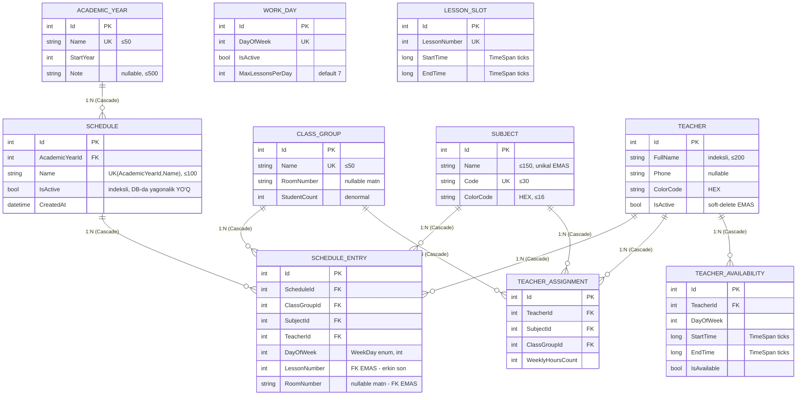
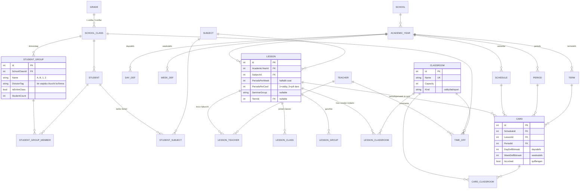

# 04 — Mavjud Domain va Ma'lumotlar bazasi auditi

> **Maqsad:** `darsjadvali` loyihasining hozirgi domen modeli va DB sxemasini aSc TimeTables
> kanonik ma'lumot modeliga solishtirib baholash.
> **Audit sanasi:** 2026-08-14 · **Qamrov:** `src/DarsJadvali.Domain/**`,
> `src/DarsJadvali.Infrastructure/Persistence/**`, `src/DarsJadvali.Infrastructure/Migrations/**`.
> **Muhim:** bu faqat audit — hech qanday fayl o'zgartirilmagan.

**Bir jumlada xulosa:** hozirgi model — bu "sinf × kun × soat" katakchalarini to'ldiruvchi
oddiy jadval muharriri (10 ta entity, 8 ta jadval). aSc modelining yadrosi bo'lgan
**lesson ≠ card** ajratmasi, **guruhlar**, **xonalar**, **haftalar/chorak**lar umuman yo'q.
Ular keyin qo'shilishi uchun mavjud unikal indekslarni **buzish** kerak bo'ladi —
ya'ni bu qo'shimcha emas, sxemani qayta qurish.

---

## 1. Mavjud entity'lar

Barchasi `DarsJadvali.Domain.Common.BaseEntity` dan meros oladi
(`src/DarsJadvali.Domain/Common/BaseEntity.cs:4` — yagona maydon: `int Id`).

| # | Entity | Maydonlar (qisqa) | Navigatsiyalar | Fayl:qator |
|---|--------|-------------------|----------------|------------|
| 1 | `AcademicYear` | `Name` (string, unikal, ≤50), `StartYear` (int), `Note` (string?, ≤500) | `Schedules` (1:N) | `Domain/Entities/AcademicYear.cs:9` |
| 2 | `Schedule` | `AcademicYearId` (int), `Name` (string, ≤100), `IsActive` (bool), `CreatedAt` (DateTime) | `AcademicYear` (N:1), `Entries` (1:N) | `Domain/Entities/Schedule.cs:9` |
| 3 | `ScheduleEntry` | `ScheduleId`, `ClassGroupId`, `SubjectId`, `TeacherId` (int), `DayOfWeek` (`WeekDay`), `LessonNumber` (int), `RoomNumber` (string?, ≤50) | `Schedule`, `ClassGroup`, `Subject`, `Teacher` (hammasi N:1) | `Domain/Entities/ScheduleEntry.cs:7` |
| 4 | `ClassGroup` | `Name` (string, unikal, ≤50), `RoomNumber` (string?, ≤50), `StudentCount` (int) | `Assignments`, `ScheduleEntries` | `Domain/Entities/ClassGroup.cs:6` |
| 5 | `Subject` | `Name` (string, ≤150), `Code` (string, unikal, ≤30), `ColorCode` (string, ≤16, HEX) | `Assignments`, `ScheduleEntries` | `Domain/Entities/Subject.cs:6` |
| 6 | `Teacher` | `FullName` (string, ≤200), `Phone` (string?, ≤50), `ColorCode` (string, ≤16), `IsActive` (bool) | `Assignments`, `Availabilities`, `ScheduleEntries` | `Domain/Entities/Teacher.cs:6` |
| 7 | `TeacherAssignment` | `TeacherId`, `SubjectId`, `ClassGroupId` (int), `WeeklyHoursCount` (int) | `Teacher`, `Subject`, `ClassGroup` | `Domain/Entities/TeacherAssignment.cs:6` |
| 8 | `TeacherAvailability` | `TeacherId` (int), `DayOfWeek` (`WeekDay`), `StartTime`/`EndTime` (`TimeSpan`), `IsAvailable` (bool) | `Teacher` | `Domain/Entities/TeacherAvailability.cs:7` |
| 9 | `WorkDay` | `DayOfWeek` (`WeekDay`, unikal), `IsActive` (bool), `MaxLessonsPerDay` (int, default 7) | — | `Domain/Entities/WorkDay.cs:7` |
| 10 | `LessonSlot` | `LessonNumber` (int, unikal), `StartTime`/`EndTime` (`TimeSpan`) | — | `Domain/Entities/LessonSlot.cs:6` |

**Enum'lar:** yagona — `WeekDay` (`Dushanba=1 … Yakshanba=7`) va
`WeekDayExtensions` (`ToUzbek()`, `All`) — `Domain/Enums/WeekDay.cs:4`.

**Common:** `AppInfo` (`Domain/Common/AppInfo.cs:4`) — 15+ `const string`: dastur nomi,
versiya, muallif, Telegram, **karta raqami**, GitHub URL'lari. Bu domen modeli emas
(pastda 5-bo'limga qarang).

**Jami:** 10 entity, 8 ta DB jadvali (`AcademicYears`, `Schedules`, `ScheduleEntries`,
`ClassGroups`, `Subjects`, `Teachers`, `TeacherAssignments`, `TeacherAvailabilities`,
`WorkDays`, `LessonSlots` — aslida 10 ta jadval).

---

## 2. Mavjud ER diagramma



> **Diqqat:** `WORK_DAY` va `LESSON_SLOT` diagrammada **hech kimga bog'lanmagan** —
> bu xato emas, sxemada haqiqatan ham ular uchun birorta ham FK yo'q.
> `SCHEDULE_ENTRY.LessonNumber` va `SCHEDULE_ENTRY.DayOfWeek` — shunchaki sonlar.

---

## 3. DB konfiguratsiyasi

### 3.1 Provider va ulanish

| Nima | Qiymat | Manba |
|------|--------|-------|
| Provider | **SQLite** (`Microsoft.EntityFrameworkCore.Sqlite`) | `src/DarsJadvali.Infrastructure/DarsJadvali.Infrastructure.csproj:9` |
| EF Core versiyasi | **8.0.11** (`$(PkgEfCore)`) | `Directory.Build.props:17` |
| TFM | `net8.0` | `DarsJadvali.Infrastructure.csproj:4` |
| Ulanish satri | kod ichida quriladi: `$"Data Source={fullPath}"` | `Infrastructure/DependencyInjection/InfrastructureServiceRegistration.cs:82` |
| DB fayl yo'li | `%LOCALAPPDATA%\DarsJadvali\darsjadvali.db` (Windows) / `~/.local/share/DarsJadvali/darsjadvali.db` | `InfrastructureServiceRegistration.cs:21-34` |
| Design-time | `Path.GetTempPath()/darsjadvali_design.db` | `Persistence/AppDbContextFactory.cs:14-18` |
| DbContext lifetime | `Scoped` (context ham, options ham) | `InfrastructureServiceRegistration.cs:39-41` |

**PostgreSQL YO'Q.** Konfiguratsiya fayli (`appsettings.json`) orqali ulanish satri
o'qilmaydi — yo'l qattiq kodlangan (`DefaultDbPath`), uni faqat `AddInfrastructureSqlite(path)`
argumenti bilan almashtirish mumkin (`Desktop/App.axaml.cs:54`, `Web/Program.cs:35`,
`UI/App.xaml.cs:30`).

### 3.2 Migratsiyalar

| Migratsiya | Nima qiladi |
|------------|-------------|
| `20260813142230_InitialCreate` | 8 ta jadval: `ClassGroups`, `LessonSlots`, `Subjects`, `Teachers`, `WorkDays`, `ScheduleEntries`, `TeacherAssignments`, `TeacherAvailabilities` |
| `20260814034350_AddAcademicYearAndSchedule` | `AcademicYears` + `Schedules` jadvallari; `ScheduleEntries.ScheduleId` ustuni; eski unikal indekslar tashlanib, `ScheduleId` bilan boshlanuvchilari yaratiladi; ma'lumot ko'chirish SQL'i |

`AppDbContextModelSnapshot.cs` model bilan mos — sxema drift yo'q.

Migratsiya ishga tushirilishi `DatabaseInitializer.InitializeAsync()`
(`Persistence/DatabaseInitializer.cs:19-25`): `MigrateAsync()` → `SeedWorkDays` (7 kun) →
`SeedLessonSlots` (7 ta soat, 08:30 dan, 45+10 daq) → `SeedSchedule` (o'quv yili + "Asosiy jadval").
Seed idempotent.

### 3.3 Indekslar (hozirgi holat)

**Unikal:**
- `AcademicYears(Name)` — `AcademicYearConfiguration.cs:23`
- `ClassGroups(Name)` — `ClassGroupConfiguration.cs:25`
- `Subjects(Code)` — `SubjectConfiguration.cs:28`
- `WorkDays(DayOfWeek)` — `WorkDayConfiguration.cs:27`
- `LessonSlots(LessonNumber)` — `LessonSlotConfiguration.cs:26`
- `Schedules(AcademicYearId, Name)` — `ScheduleConfiguration.cs:31`
- `TeacherAssignments(TeacherId, SubjectId, ClassGroupId)` — `TeacherAssignmentConfiguration.cs:32`
- `ScheduleEntries(ScheduleId, ClassGroupId, DayOfWeek, LessonNumber)` — `ScheduleEntryConfiguration.cs:45`
- `ScheduleEntries(ScheduleId, TeacherId, DayOfWeek, LessonNumber)` — `ScheduleEntryConfiguration.cs:46`

**Oddiy:** `Teachers(FullName)`, `Schedules(IsActive)`, `TeacherAvailabilities(TeacherId, DayOfWeek)`,
`ScheduleEntries(ClassGroupId | SubjectId | TeacherId)`, `TeacherAssignments(ClassGroupId | SubjectId)`.

### 3.4 Konvertorlar, delete behavior, filtrlar

- **Konvertorlar:** `TimeSpanToTicksConverter` (`TimeSpan` → `long` ticks) —
  `Persistence/Converters/TimeSpanToTicksConverter.cs:9`. `NullableTimeSpanToTicksConverter`
  e'lon qilingan, lekin **hech qayerda ishlatilmaydi** (o'lik kod).
- **Enum'lar:** `HasConversion<int>()` — `WeekDay` int sifatida saqlanadi (**yaxshi**,
  string emas): `ScheduleEntryConfiguration.cs:16`, `WorkDayConfiguration.cs:16`,
  `TeacherAvailabilityConfiguration.cs:17`.
- **Delete behavior:** **BARCHA 9 ta FK — `DeleteBehavior.Cascade`.** Birorta `Restrict`,
  `SetNull` yoki `NoAction` yo'q.
- **Query filter:** `HasQueryFilter` **umuman yo'q** (butun kod bazasida 0 ta).
- **Concurrency token:** `IsRowVersion` / `IsConcurrencyToken` **umuman yo'q** (0 ta).
- **Check constraint:** `HasCheckConstraint` **umuman yo'q** (0 ta).
- **AutoInclude:** 7 ta navigatsiyada yoqilgan (`ScheduleEntry` ×3, `TeacherAssignment` ×3,
  `TeacherAvailability` ×1, `Schedule.AcademicYear` ×1) — repozitoriy `Include` yozmasligi uchun.

### 3.5 Kamchiliklari (qisqacha)

1. `Schedule.IsActive` bo'yicha **filtered unique index yo'q** — SQLite buni qo'llab-quvvatlaydi.
2. `ScheduleEntries` da **xona bandligi bo'yicha unikal indeks yo'q** (`RoomNumber` FK ham emas).
3. `LessonNumber` va `DayOfWeek` uchun **FK yoki CHECK yo'q** → 99-soat / 9-kun kiritish mumkin.
4. `TeacherAssignment` va `ScheduleEntry` o'rtasida **bog'lanish yo'q** → reja va fakt ajralgan.
5. Barcha jadvallarda **audit maydonlari yo'q** (faqat `Schedule.CreatedAt`).

---

## 4. aSc modeliga nisbatan gap analysis

Holat belgilari: 🔴 yo'q · 🟡 qisman · 🟢 bor

| aSc konsepsiyasi | `darsjadvali`da bormi | Holat | Oqibati |
|---|---|---|---|
| **`periods`** (dars soatlari, nom/qisqa nom/boshlanish/tugash) | `LessonSlot` | 🟡 | Global — o'quv yili/jadvalga bog'lanmagan. Qo'ng'iroq jadvali o'zgarsa **eski yillar jadvali ham o'zgaradi**. Ikkinchi smena yoki boshlang'ich/yuqori sinf uchun turli vaqt jadvali qilib bo'lmaydi. `ScheduleEntry` unga FK bilan bog'lanmagan. |
| **`daysdefs`** (kun ta'riflari, bitmask: "Du", "Du+Chor", "har kuni") | `WeekDay` enum + `WorkDay` | 🟡 | Faqat bitta aniq kun. "Dushanba **va** Chorshanba" bitta dars ta'rifi sifatida ifodalanmaydi — har biri alohida yozuv. Bitmask yo'q. |
| **`weeksdefs`** (juft/toq hafta, A/B hafta, 2–4 haftalik sikl) | ❌ | 🔴 | **Ikki haftalik jadval umuman mumkin emas.** "Har ikki haftada bir marta" darslar modellanmaydi; bu ko'p maktablar uchun blokerdir. |
| **`termsdefs`** (chorak/semestr) | ❌ | 🔴 | Chorak bo'yicha jadval o'zgarishi yo'q. Faqat butun `Schedule` nusxasini qo'lda ko'chirish qoladi → ma'lumot dublikati va rassinxron. |
| **`subjects`** | `Subject` | 🟢 | Bor, lekin: `Name` unikal emas; "maxsus xona talab qiladi", "qisqa nom", "tanaffusdan keyin bo'lmasin" kabi aSc atributlari yo'q. |
| **`teachers`** | `Teacher` | 🟡 | Asosiy maydonlar bor, lekin **shartnoma soati (yuklama normasi)**, kunlik maks. dars, maks. "oyna" (bo'sh soat), qisqa nom / tabel raqami yo'q. |
| **`classrooms`** (xonalar: sig'im, turi, xonalar to'plami) | `RoomNumber` — **erkin matn** 2 joyda | 🔴 | **Eng jiddiy bo'shliqlardan biri.** Xona entity emas → (a) DB xona to'qnashuvini **umuman ushlamaydi**, (b) "5-A" va "5A" turli xona bo'lib qoladi, (c) sig'im/laboratoriya/sport zali ajratilmaydi, (d) darsga bir nechta mos xonadan birini tanlash (aSc "classroom set") imkonsiz. |
| **`grades`** (bosqich/parallel: 1-sinflar, 5-sinflar) | ❌ | 🔴 | Bosqich bo'yicha qoida ("boshlang'ich sinflar 5-soatdan keyin dars qilmasin") yozib bo'lmaydi. Hisobot va saralash `Name` matnini parsing qilishga majbur. |
| **`classes`** (sinflar) | `ClassGroup` | 🟡 | Bor, lekin sinf rahbari, bosqich (`grade`), asosiy xona FK'si, sinf uchun kunlik cheklovlar yo'q. |
| **`groups`** (sinf ichidagi bo'linma: `divisiontag`, `entireclass`) | ❌ | 🔴 | **Kritik.** Chet tili / informatika / mehnat guruhlariga bo'linish yo'q. Bundan ham yomoni — `ScheduleEntries(ScheduleId, ClassGroupId, DayOfWeek, LessonNumber)` unikal indeksi bitta sinfda bir vaqtda ikkita parallel guruh darsini **fizik jihatdan taqiqlaydi**. Ya'ni bu funksiyani qo'shish uchun mavjud indeksni buzish shart. |
| **`students`** | ❌ (`ClassGroup.StudentCount` — shunchaki son) | 🔴 | O'quvchi darajasida jadval, tanlov fanlari, guruh a'zoligi va o'quvchi bo'yicha to'qnashuv tekshiruvi imkonsiz. `StudentCount` qo'lda kiritiladi va hech qachon tekshirilmaydi. |
| **`studentsubjects`** (o'quvchi ↔ tanlov fani) | ❌ | 🔴 | Tanlov/profil fanlari (elective) modeli umuman yo'q. |
| **`lessons`** (dars TA'RIFI: fan + o'qituvchi(lar) + sinf(lar) + guruh + `periodsperweek` + `periodspercard` + `seminargroup`) | `TeacherAssignment` (juda qisqargan) | 🔴 | `TeacherAssignment` faqat `(Teacher, Subject, ClassGroup, WeeklyHoursCount)`. **Yo'q:** `periodspercard` (juft/blok dars), bir necha o'qituvchi, bir necha sinf birga (joined classes), guruh, talab qilingan xona, `seminargroup`, ustuvorlik, `AcademicYear` bog'lanishi. |
| **`cards`** (jadvalga joylashtirilgan NUSXA: `lessonid`, `period`, `days` bitmask, `weeks` bitmask, `classroomids`) | `ScheduleEntry` | 🔴 | **lesson ≠ card ajratmasi butunlay yo'q.** `ScheduleEntry` `TeacherAssignment`ga FK bilan bog'lanmagan — u `TeacherId`/`SubjectId`/`ClassGroupId` ni **qaytadan takrorlaydi**. Natijada: rejadagi soat va joylashtirilgan soat solishtirilmaydi, biriktirmasiz dars yozish mumkin, `days`/`weeks` bitmask yo'q. |
| **Cheklovlar / `constraints` / `relations`** (aSc'da alohida qoidalar to'plami) | qisman `TeacherAvailability` + `WorkDay.MaxLessonsPerDay` | 🔴 | Faqat o'qituvchi vaqti va kunlik maks. dars. **Yo'q:** "oyna bo'lmasin", "og'ir fanlar ertalab", "kunlik bir xil fan takrorlanmasin", sinf/xona cheklovlari, fanlar orasidagi bog'liqlik. Umumiy cheklov (constraint) entity'si yo'q → har bir yangi qoida yangi ustun/jadval talab qiladi. |
| **`school`** (bir nechta maktab / tenant) | ❌ | 🔴 | Bitta SQLite fayl = bitta maktab. `DarsJadvali.Web` mavjud bo'lgani uchun bu real cheklov: bitta veb-nusxada bir nechta maktab ishlay olmaydi. |
| **Barqaror tashqi Id (aSc XML `id="..."`)** | ❌ (faqat `int` autoincrement) | 🔴 | aSc XML import/eksport yoki Desktop↔Web sinxronizatsiyasida Id to'qnashuvi; import har safar yangi Id yaratadi, idempotent bo'lmaydi. |
| **`AcademicYear` / jadval variantlari** | `AcademicYear` + `Schedule` | 🟢 | Bu qism aSc'dan **kuchliroq** — aSc'da jadval varianti fayl darajasida bo'ladi. Yagona kamchilik: `IsActive` yagonaligi DB'da kafolatlanmagan. |

**Ortiqcha / noto'g'ri joyda turgan narsalar:**

| Nima | Muammo |
|------|--------|
| `AppInfo` (`Domain/Common/AppInfo.cs`) | Karta raqami, Telegram, GitHub URL, `User-Agent` — bular domen emas, konfiguratsiya/prezentatsiya. Domain qatlamini ifloslantiradi. |
| `NullableTimeSpanToTicksConverter` | E'lon qilingan, hech qayerda ishlatilmaydi — o'lik kod. |
| `ClassGroup.RoomNumber` + `ScheduleEntry.RoomNumber` | Bir tushuncha ikki joyda matn sifatida — normalizatsiya buzilgan. |
| `ClassGroup.StudentCount` | `Student` entity paydo bo'lsa darhol denormallashgan/rassinxron maydonga aylanadi. |
| `ScheduleEntry.TeacherId/SubjectId` | `TeacherAssignment` bo'lgani uchun bular hosila ma'lumot — takrorlanish. |
| `WeekDayExtensions.ToUzbek()` | Domain'da lokalizatsiya — UI qatlamining vazifasi. |

---

## 5. Topilgan muammolar (jiddiylik bo'yicha)

### 🔴 P0 — Bloker (aSc modeliga o'tishga to'sqinlik qiladi)

**P0-1. `ScheduleEntryConfiguration.cs:45` — sinf bo'yicha unikal indeks guruhlarni abadiy taqiqlaydi**
`(ScheduleId, ClassGroupId, DayOfWeek, LessonNumber)` unikal.
*Nima sindiradi:* bitta sinfda bir vaqtda ikki guruh (ingliz tili A/B, informatika 1/2)
darsi **hech qachon** yozib bo'lmaydi — DB `UNIQUE constraint failed` beradi.
*Tuzatish:* indeksga `StudentGroupId` (yoki `DivisionTag`) qo'shish; bo'linmagan dars uchun
"entire class" maxsus guruh yozuvidan foydalanish.

**P0-2. `Domain/Entities/ScheduleEntry.cs:7` — lesson va card bir entity'da qorishgan**
`ScheduleEntry` bir vaqtning o'zida ham "qanday dars" (fan+o'qituvchi+sinf), ham
"qayerga joylashtirildi" (kun+soat) ni saqlaydi va `TeacherAssignment`ga bog'lanmagan.
*Nima sindiradi:* (a) `WeeklyHoursCount` reja bilan joylashtirilgan darslar soni
solishtirilmaydi — "3 soatdan 2 tasi qo'yildi" ko'rsatkichi hisoblanmaydi;
(b) mavjud bo'lmagan biriktirma bo'yicha dars yozish mumkin (`TeacherAssignment` o'chsa
`ScheduleEntry` qoladi — FK yo'q); (c) juft dars (`periodspercard=2`) ifodalanmaydi.
*Tuzatish:* `Lesson` (ta'rif) va `Card` (joylashtirish) ga ajratish; `Card.LessonId` — FK.

**P0-3. `Domain/Entities/ScheduleEntry.cs:40` — `Classroom` entity yo'q, xona erkin matn**
*Nima sindiradi:* bitta xonada bir vaqtda ikkita dars bo'lishini **hech nima to'xtatmaydi** —
na DB, na indeks. Imlo farqi ("12-xona" / "12 xona") ikki xil xona. Sig'im, xona turi,
muqobil xonalar to'plami yo'q.
*Tuzatish:* `Classroom` entity + `Card.ClassroomId` FK + unikal indeks
`(ScheduleId, ClassroomId, DayOfWeek, PeriodId)`.

**P0-4. `weeksdefs` / `termsdefs` yo'q → sxemada hafta va chorak o'lchovi umuman yo'q**
*Nima sindiradi:* ikki haftalik (A/B) jadval va chorak bo'yicha o'zgarish qo'shilganda
`ScheduleEntries` ning ikkala unikal indeksi ham noto'g'ri bo'lib qoladi (bir xil
o'rin toq va juft haftada boshqa dars bo'lishi kerak) — ya'ni **kelajakdagi migratsiya
mavjud ma'lumotni buzadi**.
*Tuzatish:* `WeeksDef`/`TermsDef` entity'lari + `Card.WeeksBitmask`/`TermId`,
va bularni unikal indekslarga kiritish.

**P0-5. `LessonSlot` va `WorkDay` ga FK yo'q (`ScheduleEntry.cs:34,37`)**
`DayOfWeek` va `LessonNumber` — oddiy `int`, na FK, na CHECK.
*Nima sindiradi:* `LessonNumber = 99` yoki nofaol Yakshanbaga dars yozish DB darajasida
o'tib ketadi; `LessonSlot` o'chirilsa unga ishora qiluvchi yozuvlar "osilib" qoladi va
jadval bo'sh katakcha ko'rsatadi.
*Tuzatish:* `Card.PeriodId` → `Period(Id)` FK; kun uchun `DayDefId` FK yoki
`CHECK (DayOfWeek BETWEEN 1 AND 7)`.

**P0-6. `LessonSlot`, `WorkDay`, `TeacherAssignment` — o'quv yiliga bog'lanmagan (global)**
*Nima sindiradi:* qo'ng'iroq jadvalini yoki yuklamani o'zgartirish **o'tgan yillar
jadvalini ham o'zgartiradi** — arxiv haqiqiy emas. `TeacherAssignments(TeacherId,
SubjectId, ClassGroupId)` unikal indeksi bir o'qituvchining ikki yilda bir xil
sinf+fanni o'qitishini taqiqlaydi.
*Tuzatish:* uchalasiga ham `AcademicYearId` (yoki `ScheduleId`) ustuni qo'shib,
unikal indekslarga kiritish.

### 🟠 P1 — Yuqori (ma'lumot yo'qolishi / noto'g'ri natija)

**P1-7. `ScheduleConfiguration.cs:34` — `IsActive` yagonaligi DB'da kafolatlanmagan**
Indeks bor, lekin unikal emas; qoida faqat `DatabaseInitializer.cs:68-79` va
`ActiveScheduleResolver` kodida.
*Nima sindiradi:* ikkita parallel jarayon (Desktop + Web bitta faylda) ikkita faol
jadval yaratishi mumkin → dastur qaysi biri "faol" ekanini `FirstOrDefault` bilan
tasodifiy tanlaydi.
*Tuzatish:* SQLite filtered unique index: `CREATE UNIQUE INDEX ... ON "Schedules"("IsActive") WHERE "IsActive" = 1`.

**P1-8. Barcha 9 ta FK `Cascade` — ogohlantirishsiz ommaviy o'chirish**
`ScheduleEntryConfiguration.cs:26,31,36,41`, `TeacherAssignmentConfiguration.cs:19,24,29`,
`TeacherAvailabilityConfiguration.cs:35`, `ScheduleConfiguration.cs:28`.
*Nima sindiradi:* bitta o'qituvchini o'chirish uning butun yillik jadvalini jimgina
o'chiradi; `AcademicYear` o'chirilsa barcha jadvallar va barcha darslar ketadi.
Qaytarib bo'lmaydi — soft delete ham, audit ham yo'q.
*Tuzatish:* ma'lumotnoma jadvallariga `DeleteBehavior.Restrict`; `Card`ga faqat
`Lesson`/`Schedule` dan `Cascade`; soft delete qo'shish.

**P1-9. Concurrency token umuman yo'q + `EfRepository.UpdateAsync` to'liq yozadi**
`Repositories/EfRepository.cs:37-42` — `Set.Update(entity)` **barcha** ustunlarni yozadi,
`DetachIfDuplicate` esa kuzatilayotgan (yangiroq) nusxani ataylab ajratib tashlaydi.
*Nima sindiradi:* klassik **lost update** — ikki foydalanuvchi bir yozuvni tahrirlasa
oxirgisi birinchisining o'zgarishini bilmasdan bekor qiladi. Web ilova bo'lgani uchun bu
nazariy emas.
*Tuzatish:* `BaseEntity`ga `RowVersion` (SQLite'da `rowversion` yo'q — `Guid`/`int`
`IsConcurrencyToken()` bilan yoki `xmin` PostgreSQL'da), `DbUpdateConcurrencyException` ishlovi.

**P1-10. Audit maydonlari va soft delete yo'q**
Butun modelda yagona vaqt maydoni — `Schedule.CreatedAt`.
*Nima sindiradi:* kim, qachon, nimani o'zgartirgani noma'lum; "bekor qilish" (undo) va
"o'chirilganlarni tiklash" imkonsiz; `Teacher.IsActive` soft delete emas (query filter yo'q,
nofaol o'qituvchi hamma ro'yxatlarda ko'rinadi).
*Tuzatish:* `BaseEntity` → `CreatedAt`, `UpdatedAt`, `IsDeleted` + `SaveChanges` interceptor
+ `HasQueryFilter(e => !e.IsDeleted)`.

**P1-11. Har bir repozitoriy metodi o'z `SaveChangesAsync`ini chaqiradi**
`EfRepository.cs:33,41,50` — `UnitOfWork` mavjud bo'lsa-da, u faqat repozitoriylar
konteyneri (`UnitOfWork.cs:36`).
*Nima sindiradi:* butun jadvalni generatsiya qilish N ta alohida commit — yarim yo'lda
xato/uzilish bo'lsa baza **qisman to'ldirilgan, nomuvofiq** holatda qoladi.
Tranzaksiya chegarasi yo'q.
*Tuzatish:* `SaveChanges`ni repozitoriylardan olib tashlab, faqat `IUnitOfWork`da qoldirish.

### 🟡 P2 — O'rta (sifat, ishlash, ko'chirish)

**P2-12. `TimeSpan` → ticks (`Converters/TimeSpanToTicksConverter.cs:9`)**
*Nima sindiradi:* SQL'da qiymatlar inson uchun o'qilmaydi (`30600000000` = 08:30);
tashqi hisobot vositalari bilan ishlatib bo'lmaydi; PostgreSQL'ga ko'chirilganda
`time` turiga alohida migratsiya kerak. .NET 8 da semantik to'g'ri tur — `TimeOnly`.
*Tuzatish:* `TimeOnly` + `TimeOnlyConverter` (yoki `int MinutesFromMidnight`).

**P2-13. `WeekDay` enum `System.DayOfWeek` bilan mos emas (`Enums/WeekDay.cs:4`)**
`Dushanba=1 … Yakshanba=7`, `System.DayOfWeek` esa `Sunday=0 … Saturday=6`.
*Nima sindiradi:* `(int)DateTime.Now.DayOfWeek` bilan taqqoslash jimgina noto'g'ri
natija beradi (bir kunga siljish) — ayniqsa eksport/import va kalendar integratsiyasida.
*Tuzatish:* aniq konvertatsiya metodi va uni yagona joyda saqlash; nomlarni UI'ga ko'chirish.

**P2-14. 7 ta `AutoInclude()` — har bir so'rovda majburiy JOIN**
`ScheduleEntryConfiguration.cs:48-50`, `TeacherAssignmentConfiguration.cs:35-37`,
`TeacherAvailabilityConfiguration.cs:39`, `ScheduleConfiguration.cs:36`.
*Nima sindiradi:* `ScheduleEntries.GetAllAsync()` har safar 3 ta JOIN qiladi va
`EfRepository` ataylab `AsNoTracking` ishlatmaydi (`EfRepository.cs:11` izohi) →
30 sinf × 6 kun × 7 soat ≈ 1260 yozuv to'liq materiallashadi va change tracker'ga tushadi.
`IgnoreAutoIncludes()` Application qatlamida chaqirilmaydi, chunki u EF Core'ni ko'rmaydi.
*Tuzatish:* `AutoInclude`ni olib tashlab, aniq `Include` bilan ishlaydigan maxsus
repozitoriy metodlari / proyeksiya (DTO) qo'shish.

**P2-15. `Subject.Name` unikal emas (`SubjectConfiguration.cs:14`)**
Faqat `Code` unikal. *Nima sindiradi:* "Matematika" nomli ikkita fan yaratilishi mumkin —
hisobotlarda chalkashlik. *Tuzatish:* `Name` ga ham unikal indeks.

**P2-16. `TeacherAvailability` oraliqlari ustma-ust tushishi mumkin (`TeacherAvailabilityConfiguration.cs:37`)**
Indeks bor, lekin unikal emas; `StartTime < EndTime` CHECK yo'q; overlap tekshiruvi yo'q.
`IsAvailable` bitta jadvalda ikki xil semantikani (mavjudlik/bandlik) aralashtiradi.
*Nima sindiradi:* `08:00–10:00 (available)` va `09:00–11:00 (unavailable)` bir vaqtda
saqlanadi — algoritm qaysi biriga ishonishini bilmaydi.
*Tuzatish:* vaqt oralig'i o'rniga `PeriodId` bo'yicha mavjudlik matritsasi
(`(TeacherId, DayOfWeek, PeriodId)` unikal) — aSc ham shunday ishlaydi.

**P2-17. `Schedule.CreatedAt` uchun `DateTimeKind` yo'qoladi**
`Schedule.cs:24` — `DateTime.UtcNow`; SQLite `TEXT` sifatida saqlaydi, o'qilganda
`Kind = Unspecified` qaytadi. Bir joyda `DateTime.UtcNow`, boshqa joyda `DateTime.Now`
(`DatabaseInitializer.cs:45`, migratsiya `AddAcademicYearAndSchedule.cs:74`).
*Nima sindiradi:* vaqt zonasi bo'yicha noto'g'ri saralash/ko'rsatish.
*Tuzatish:* `DateTimeOffset` yoki `DateTime` + `UtcConverter`, va `TimeProvider` inyeksiyasi.

**P2-18. `ColorCode` — validatsiyasiz HEX matn**
`SubjectConfiguration.cs:22`, `TeacherConfiguration.cs:21` — `maxLength: 16`, CHECK yo'q.
*Nima sindiradi:* `"qizil"` yozilsa UI'da rang render bo'lmaydi; 16 belgi HEX uchun ortiqcha.
*Tuzatish:* `CHECK (ColorCode GLOB '#[0-9A-Fa-f]*')` yoki value object.

### 🔵 P3 — Past (tozalik)

- **P3-19.** `AppInfo` (`Domain/Common/AppInfo.cs:4`) — karta raqami/Telegram/GitHub URL
  domen qatlamida. Konfiguratsiyaga ko'chirilishi kerak.
- **P3-20.** `NullableTimeSpanToTicksConverter` (`Converters/TimeSpanToTicksConverter.cs:18`) —
  hech qayerda ishlatilmaydi.
- **P3-21.** `DatabaseInitializer.cs:83-95` — `orphans` qidiruvi (`!validIds.Contains(e.ScheduleId)`)
  **hech qachon yozuv topa olmaydi**, chunki `ScheduleId` majburiy FK va DB buni allaqachon
  kafolatlaydi. Har startda 2 ta ortiqcha so'rov — o'lik kod.
- **P3-22.** O'quv yili nomini hisoblash mantig'i **3 joyda takrorlangan**:
  `ActiveScheduleResolver.cs:23-24`, `DatabaseInitializer.cs:45`,
  `AddAcademicYearAndSchedule.cs:75-76`. Biri o'zgarsa boshqalari orqada qoladi.
- **P3-23.** `AddAcademicYearAndSchedule.cs:74-78` — migratsiya matniga
  `DateTime.Now`/`UtcNow` **ishga tushish vaqtida** tikiladi → migratsiya deterministik emas
  (turli mashinada turli o'quv yili yaratilishi mumkin).
- **P3-24.** `int` autoincrement Id — import/eksport va Desktop↔Web sinxronizatsiyasida
  barqaror kalit yo'q (`BaseEntity.cs:7`).
- **P3-25.** `WeekDayExtensions.ToUzbek()` (`Enums/WeekDay.cs:43`) — lokalizatsiya Domain'da.

---

## 6. Tavsiya etilgan yangi sxema

### 6.1 Yo'nalish

aSc modelining yadrosi — **uch qatlam**:

```
Ma'lumotnomalar  →  Lesson (dars TA'RIFI, nechta soat)  →  Card (JOYLASHTIRISH: qayerda, qachon)
```

Hozirgi model bu uch qatlamni ikkitaga siqib qo'ygan. Asosiy o'zgarish — o'rtadagi
`Lesson` qatlamini tiklash va `Card`ni faqat joylashtirishga qoldirish.

### 6.2 Yangi ER diagramma (maqsad holat)



### 6.3 Migratsiya rejasi

Har bir bosqich mustaqil migratsiya — oldingisi ishlab turgan holda qo'llanadi.
Umumiy tamoyil: **avval yangi struktura, keyin ma'lumot ko'chirish, oxirida eski ustun/indeks o'chiriladi.**

#### Bosqich 0 — Poydevor (buzmaydigan, darhol qilinadi)

| Amal | Nima |
|------|------|
| ➕ | `BaseEntity` → `CreatedAt`, `UpdatedAt`, `IsDeleted`, `RowVersion` (concurrency token) |
| ➕ | `SaveChanges` interceptor — audit maydonlarini avtomatik to'ldiradi |
| ➕ | Soft delete uchun `HasQueryFilter(e => !e.IsDeleted)` |
| 🔧 | `Schedules(IsActive)` → **filtered unique index** (`WHERE IsActive = 1`) |
| 🔧 | Ma'lumotnoma FK'lari `Cascade` → `Restrict` |
| 🔧 | `EfRepository` dan `SaveChangesAsync` olib tashlanadi → `IUnitOfWork` tranzaksiya chegarasi |
| ➖ | `NullableTimeSpanToTicksConverter`, `DatabaseInitializer` dagi o'lik `orphans` bloki |

*Xavf:* past. Ma'lumot ko'chirish talab qilinmaydi (yangi ustunlar default bilan).

#### Bosqich 1 — Ma'lumotnomalarni to'ldirish

| Amal | Entity |
|------|--------|
| ➕ | `Classroom` (`Name` UK, `Capacity`, `Kind`, `IsActive`) |
| ➕ | `Grade` (bosqich: `Level`, `Name`) |
| ➕ | `Term` (chorak: `AcademicYearId`, `Name`, `StartDate`, `EndDate`, `Ordinal`) |
| ➕ | `WeekDef` (`Name`, `Bitmask` — "har hafta", "toq", "juft") |
| ➕ | `DayDef` (`Name`, `Bitmask` — "Du", "Du+Chor", "har kuni") |
| 🔧 | `ClassGroup` → `SchoolClass` deb qayta nomlanadi; `GradeId` FK, `HomeClassroomId` FK, `HomeroomTeacherId` FK qo'shiladi; `RoomNumber` matni `Classroom` ga ko'chiriladi |
| 🔧 | `LessonSlot` → `Period`; `AcademicYearId` FK qo'shiladi; `TimeSpan` → `TimeOnly` |
| 🔧 | `WorkDay` → `AcademicYearId` FK qo'shiladi |
| 🔧 | `Teacher` → `ContractHoursPerWeek`, `MaxLessonsPerDay`, `MaxGapsPerDay`, `ShortName` |
| 🔧 | `Subject` → `ShortName`, `RequiresSpecialClassroom`, `Name` unikal |

*Ma'lumot ko'chirish:* `ClassGroup.RoomNumber` va `ScheduleEntry.RoomNumber` dagi
**distinct** matnlardan `Classroom` yozuvlari generatsiya qilinadi, keyin FK'lar to'ldiriladi.
*Xavf:* o'rta — imlo variantlari qo'lda birlashtirishni talab qilishi mumkin.

#### Bosqich 2 — Guruhlar va o'quvchilar

| Amal | Entity |
|------|--------|
| ➕ | `StudentGroup` (`SchoolClassId`, `Name`, `DivisionTag`, `IsEntireClass`, `StudentCount`) |
| ➕ | `Student`, `StudentGroupMember`, `StudentSubject` |
| 🔧 | Har bir `SchoolClass` uchun `IsEntireClass = true` bo'lgan **bitta standart guruh** avtomatik yaratiladi |
| ➖ | `ClassGroup.StudentCount` → `Student` sanoviga asoslangan hisoblanuvchi qiymatga aylanadi |

*Xavf:* past (yangi jadvallar, mavjudlariga tegmaydi).

#### Bosqich 3 — 🔴 Yadro: `Lesson` va `Card` ajratmasi

Bu eng katta va eng xavfli bosqich.

| Amal | Entity |
|------|--------|
| ➕ | `Lesson` (`AcademicYearId`, `SubjectId`, `PeriodsPerWeek`, `PeriodsPerCard`, `SeminarGroup`, `TermId?`, `Priority`) |
| ➕ | `LessonTeacher` (N:N — bir darsda bir necha o'qituvchi) |
| ➕ | `LessonClass` (N:N — joined classes) |
| ➕ | `LessonGroup` (N:N — qaysi guruhlar uchun) |
| ➕ | `LessonClassroom` (N:N — mos xonalar to'plami) |
| ➕ | `Card` (`ScheduleId`, `LessonId`, `PeriodId`, `DayDefBitmask`, `WeekDefBitmask`, `TermId?`, `IsLocked`) |
| ➕ | `CardClassroom` (N:N — cardga tayinlangan xona(lar)) |
| ➖ | `TeacherAssignment` → `Lesson` + `LessonTeacher` + `LessonClass` ga ko'chiriladi va o'chiriladi |
| ➖ | `ScheduleEntry` → `Card` ga ko'chiriladi va o'chiriladi |

**Ma'lumot ko'chirish algoritmi:**
1. Har bir `TeacherAssignment` → bitta `Lesson` (`PeriodsPerWeek = WeeklyHoursCount`,
   `PeriodsPerCard = 1`) + bitta `LessonTeacher` + bitta `LessonClass` +
   bitta `LessonGroup` (entire-class guruhi).
2. Har bir `ScheduleEntry` → mos `Lesson` topiladi
   (`TeacherId + SubjectId + ClassGroupId` bo'yicha); **topilmasa** — yetim yozuv uchun
   avtomatik `Lesson` yaratiladi (`PeriodsPerWeek` = shu triple bo'yicha yozuvlar soni).
3. `Card` yaratiladi: `PeriodId` = `LessonNumber` bo'yicha `Period`,
   `DayDefBitmask = 1 << (DayOfWeek - 1)`, `WeekDefBitmask = 0xFF` (har hafta).
4. `ScheduleEntry.RoomNumber` → `CardClassroom`.

**Yangi unikal indekslar** (eskilarining o'rniga):
- `Card(ScheduleId, PeriodId, DayDefBitmask, WeekDefBitmask, TeacherId)` — o'qituvchi to'qnashuvi
- `Card(ScheduleId, PeriodId, DayDefBitmask, WeekDefBitmask, StudentGroupId)` — guruh to'qnashuvi
  (endi **sinf** emas — guruhlar parallel bo'la oladi)
- `CardClassroom` orqali: `(ScheduleId, ClassroomId, PeriodId, Day/Week)` — **xona to'qnashuvi**

> Bitmask ustidagi to'qnashuvni faqat unikal indeks bilan ushlab bo'lmaydi
> (`AND` amali kerak). Shuning uchun indekslar **denormallashgan** `CardOccurrence`
> jadvali orqali quriladi: har bir card kengaytirilib (kun × hafta) alohida qatorga
> yoziladi, unikal indekslar esa o'sha jadvalga qo'yiladi. Bu aSc'ning ichki
> yondashuviga eng yaqin va DB darajasida haqiqiy kafolat beradi.

*Xavf:* **yuqori.** Migratsiyadan oldin majburiy: (a) DB fayl zaxirasi,
(b) `tests/DarsJadvali.Tests/DatabaseMigrationTests.cs` ga to'liq ma'lumotli
"before/after" testi, (c) migratsiyadan keyin `COUNT(*)` solishtiruvi
(`ScheduleEntries` soni == `Card` soni).

#### Bosqich 4 — Cheklovlar (constraints)

| Amal | Entity |
|------|--------|
| ➕ | `TimeOff` — umumiy mavjudlik matritsasi: `(OwnerType, OwnerId, DayOfWeek, PeriodId, Availability)`, `OwnerType` ∈ {Teacher, Class, Classroom, Subject} |
| ➕ | `ScheduleConstraint` — generik qoida: `Kind` (enum), `TargetType`, `TargetId`, `Weight`, `Parameters` (JSON) |
| ➖ | `TeacherAvailability` → `TimeOff` ga ko'chiriladi va o'chiriladi |

*Foyda:* har bir yangi qoida uchun yangi ustun/jadval kerak bo'lmaydi — `ScheduleConstraint`
qatori yetarli.

#### Bosqich 5 — Multi-tenant va ko'chirish (ixtiyoriy, `Web` uchun)

| Amal | Nima |
|------|------|
| ➕ | `School` entity; barcha ildiz entity'larga `SchoolId` + global `HasQueryFilter` |
| ➕ | `ExternalId` (`Guid`) — aSc XML import/eksport uchun barqaror kalit |
| 🔧 | SQLite → **PostgreSQL** (`Npgsql`): `TimeOnly` → `time`, `RowVersion` → `xmin`, `int` → `identity` |

### 6.4 Xulosa — o'zgarishlar hajmi

| | Qo'shiladi | O'zgaradi | O'chiriladi |
|---|---|---|---|
| **Entity soni** | ~22 | ~8 | 3 (`TeacherAssignment`, `ScheduleEntry`, `TeacherAvailability`) |
| **Bosqichlar** | 6 ta migratsiya | — | — |

Mavjud 10 entity'dan **7 tasi** (`AcademicYear`, `Schedule`, `Subject`, `Teacher`,
`ClassGroup`→`SchoolClass`, `LessonSlot`→`Period`, `WorkDay`) qoladi va kengayadi.
**3 tasi** to'liq almashtiriladi. Ya'ni bu refaktoring emas — **modelni qayta qurish**,
lekin ma'lumot yo'qotmasdan, bosqichma-bosqich bajarilishi mumkin.

### 6.5 Darhol qilinadigan 5 ta ish (Bosqich 0 dan)

1. `Schedules.IsActive` uchun filtered unique index — 1 qatorlik migratsiya, jiddiy bag'ni yopadi.
2. `BaseEntity`ga `RowVersion` + audit maydonlari — keyingi barcha bosqichlar uchun poydevor.
3. Ma'lumotnoma FK'larini `Cascade` → `Restrict` — tasodifiy ma'lumot yo'qotishni to'xtatadi.
4. `EfRepository` dan `SaveChangesAsync` ni olib tashlash — tranzaksiya butunligi.
5. `Classroom` entity (Bosqich 1 dan) — xona to'qnashuvi hozir **umuman** tekshirilmaydi.
